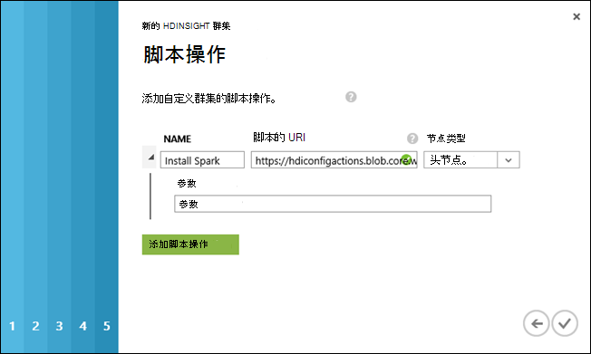
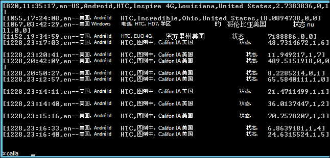

<properties
    pageTitle="使用脚本操作在 Hadoop 群集上安装触发 |Microsoft Azure"
    description="了解如何使用脚本操作触发自定义 HDInsight 群集。"
    services="hdinsight"
    documentationCenter=""
    authors="nitinme"
    manager="jhubbard"
    editor="cgronlun"/>

<tags
    ms.service="hdinsight"
    ms.workload="big-data"
    ms.tgt_pltfrm="na"
    ms.devlang="na"
    ms.topic="article"
    ms.date="02/05/2016"
    ms.author="nitinme"/>

# 安装和使用在 HDInsight Hadoop 群集使用脚本操作触发

> [AZURE.IMPORTANT] 本文现已被否决。 HDInsight 现在提供触发作为一类群集类型基于 Windows 群集，这意味着您现在可以直接创建触发群集而无需修改 Hadoop 群集使用脚本的操作。 使用群集类型的触发，获得 HDInsight 3.2 版本群集版本 1.3.1 触发。  若要安装触发的不同版本，可以使用脚本操作。 HDInsight 提供了一个示例脚本，脚本操作。

了解如何在 Windows 上安装触发基于 HDInsight 使用脚本的操作，以及如何在 HDInsight 上运行触发查询群集。

**相关的文章**

- [在 HDInsight 中的创建 Hadoop 群集](hdinsight-provision-clusters.md)︰ 创建 HDInsight 群集的一般信息。

- [在 HDInsight 上的 Apache 触发开始](hdinsight-apache-spark-jupyter-spark-sql.md)︰ 创建一个 HDInsight 触发的群集。

- [自定义 HDInsight 群集使用脚本操作][hdinsight-cluster-customize]︰ 自定义 HDInsight 群集使用脚本操作的一般信息。

- [HDInsight 的开发脚本操作脚本](hdinsight-hadoop-script-actions.md)。

## 触发是什么？

<a href="http://spark.apache.org/docs/latest/index.html" target="_blank">Apache 触发</a>是开源的并行处理支持内存中处理大数据分析应用程序的性能提高的框架。 触发的内存中计算能力使其适合用于迭代算法在机器学习和关系图的计算中。

此外可以使用触发执行传统的基于磁盘的数据处理。 触发避免写入磁盘中的中间阶段，从而提高了传统 MapReduce 框架。 此外，触发与程序兼容 Hadoop 分布式文件系统 (HDFS) 和 Azure Blob 存储以便可以轻松地通过触发处理现有的数据。

本主题说明如何自定义要安装触发 HDInsight 群集。

## 安装触发使用 Azure 门户

[Https://hdiconfigactions.blob.core.windows.net/sparkconfigactionv03/spark-installer-v03.ps1](https://hdiconfigactions.blob.core.windows.net/sparkconfigactionv03/spark-installer-v03.ps1)在一个只读的 Azure 存储 blob 提供了一个示例脚本，在一个 HDInsight 群集上安装触发。 此脚本可以安装触发 1.2.0 或触发 1.0.2，具体取决于您创建的 HDInsight 群集版本。

- 如果您创建一个**HDInsight 3.2**群集时使用的脚本，它安装**触发 1.2.0**。
- 如果您创建一个**HDInsight 3.1**群集时使用的脚本，它安装**触发 1.0.2**。

您可以修改此脚本或创建您自己的脚本来安装其他版本的触发。

> [AZURE.NOTE] 示例脚本仅适用于 HDInsight 3.1 和 3.2 群集。 HDInsight 群集版本的详细信息，请参阅[HDInsight 群集版本](hdinsight-component-versioning.md)。

1. 通过开始创建群集使用的**自定义**选项，在[创建 Hadoop 群集在 HDInsight 中的](hdinsight-provision-clusters.md#portal)所述。 选择群集版本，具体取决于以下︰

    - 如果您想要安装**触发 1.2.0**，创建 HDInsight 3.2 群集。
    - 如果您想要安装**触发 1.0.2**，创建一个 HDInsight 3.1 的群集。

2. 在向导的**脚本操作**页上，单击**添加脚本操作**以提供详细信息的脚本操作，如下所示︰

    

    <table border='1'>
        <tr><th>属性</th><th>值</th></tr>
        <tr><td>名称</td>
            <td>指定脚本动作的名称。 例如，为<b>安装触发</b>。</td></tr>
        <tr><td>脚本的 URI</td>
            <td>指定脚本调用自定义群集的统一资源标识符 (URI)。 例如， <i>https://hdiconfigactions.blob.core.windows.net/sparkconfigactionv03/spark-installer-v03.ps1</i></td></tr>
        <tr><td>节点类型</td>
            <td>指定在其运行的自定义脚本的节点。 您可以选择<b>所有节点</b>、<b>只头节点</b>或<b>仅辅助节点</b>。
        <tr><td>参数</td>
            <td>指定的参数，如果所需的脚本。 要安装触发的脚本不需要任何参数，因此您可以将其留空。</td></tr>
    </table>

    您可以添加多个安装在群集上的多个组件的脚本操作。 添加脚本后，单击以开始创建群集的选中标记。

您还可以使用脚本使用 Azure PowerShell 或 HDInsight.NET SDK 在 HDInsight 上安装触发。 在本主题后面提供了有关这些过程的说明。

## 在 HDInsight 中使用触发
触发提供在 Scala，Python 和 Java 的 Api。 您还可以使用触发交互式外壳程序运行查询的触发。 本节说明如何使用不同的方法来处理触发︰

- [使用触发 shell 运行交互式查询](#sparkshell)
- [使用触发 shell 运行触发 SQL 查询](#sparksql)
- [使用独立 Scala 程序](#standalone)

###使用触发 shell 运行交互式查询
执行以下步骤来从触发交互式外壳程序运行触发查询。 在本节中，我们运行触发查询的示例数据文件 (/ example/data/gutenberg/davinci.txt) HDInsight 群集默认情况下可用。

1. 从 Azure 的门户，与触发安装，然后远程创建到该群集的群集中启用远程桌面。 有关说明，请参阅[HDInsight 群集使用 RDP 连接](hdinsight-administer-use-management-portal.md#rdp)。

2. 在远程桌面协议 (RDP) 会话中，从桌面，打开 Hadoop 命令行 （从桌面快捷方式），并导航到的位置触发的安装位置;例如， **C:\apps\dist\spark-1.2.0**。

3. 运行以下命令以启动触发外壳程序︰

         .\bin\spark-shell --master yarn

    命令完成之后，您应该获取 Scala 提示︰

         scala>

5. 在 Scala 提示时，输入触发查询如下所示。 此查询计算/示例/数据/谷登堡/上的位置与群集相关的 Azure Blob 存储在 davinci.txt 文件中的每个单词的匹配项。

        val file = sc.textFile("/example/data/gutenberg/davinci.txt")
        val counts = file.flatMap(line => line.split(" ")).map(word => (word, 1)).reduceByKey(_ + _)
        counts.toArray().foreach(println)

6. 输出应如下所示︰

    

7. 输入︰ q 退出 Scala 提示。

        :q

###使用触发 shell 运行触发 SQL 查询

触发 SQL 可以使用触发运行关系表示结构化查询语言 (SQL)、 HiveQL 或 Scala 中的查询。 在本节中，我们使用触发运行配置单元查询示例配置单元表上。 在创建群集时，默认情况下可用本节 （称为**hivesampletable**） 中使用的配置单元表。

>[AZURE.NOTE] 下面的示例创建对**激发 1.2.0**，如果您运行脚本操作创建 HDInsight 3.2 群集时安装的。

1. 从 Azure 的门户，与触发安装，然后远程创建到该群集的群集中启用远程桌面。 有关说明，请参阅[HDInsight 群集使用 RDP 连接](hdinsight-administer-use-management-portal.md#rdp)。

2. 在 RDP 会话中，从桌面，打开 Hadoop 命令行 （从桌面快捷方式），并导航到的位置触发的安装位置;例如， **C:\apps\dist\spark-1.2.0**。

3. 运行以下命令以启动触发外壳程序︰

         .\bin\spark-shell --master yarn

    命令完成之后，您应该获取 Scala 提示︰

         scala>

4. 在 Scala 提示，设置配置单元上下文。 这是需要通过使用触发配置单元查询处理。

        val hiveContext = new org.apache.spark.sql.hive.HiveContext(sc)

    请注意该**sc**是默认触发上下文时启动触发外壳程序设置。

5. 通过使用配置单元的上下文中运行配置单元查询和打印输出到控制台。 查询检索的特定品牌的设备上的数据，并限制为 20 中检索的记录数。

        hiveContext.sql("""SELECT * FROM hivesampletable WHERE devicemake LIKE "HTC%" LIMIT 20""").collect().foreach(println)

6. 您应该看到类似于下面的输出︰

    

7. 输入︰ q 退出 Scala 提示。

        :q

### 使用独立 Scala 程序

在本节中，我们编写的 Scala 应用程序计数的行包含的字母 a 和 b 中的示例数据文件 (/ example/data/gutenberg/davinci.txt) HDInsight 群集默认情况下可用。 编写和使用触发安装自定义群集使用独立 Scala 程序，您必须执行以下步骤︰

- 编写一个程序，Scala
- 生成的 Scala 程序.jar 文件
- 在群集上运行的作业

#### 编写一个程序，Scala
在本节中，您编写 Scala 程序包含的行数进行计数 a 和 b 中的示例数据文件。

1. 打开一个文本编辑器并粘贴以下代码︰

        /* SimpleApp.scala */
        import org.apache.spark.SparkContext
        import org.apache.spark.SparkContext._
        import org.apache.spark.SparkConf

        object SimpleApp {
          def main(args: Array[String]) {
            val logFile = "/example/data/gutenberg/davinci.txt"         //Location of the sample data file on Azure Blob storage
            val conf = new SparkConf().setAppName("SimpleApplication")
            val sc = new SparkContext(conf)
            val logData = sc.textFile(logFile, 2).cache()
            val numAs = logData.filter(line => line.contains("a")).count()
            val numBs = logData.filter(line => line.contains("b")).count()
            println("Lines with a: %s, Lines with b: %s".format(numAs, numBs))
          }
        }

2. 使用**SimpleApp.scala**的名称保存文件。

#### 生成的 Scala 程序
在本节中，您使用<a href="http://www.scala-sbt.org/0.13/docs/index.html" target="_blank">简单的生成工具</a>（或 sbt） 生成 Scala 程序。 sbt 需要 Java 1.6 或更高版本，因此，请确保您有正确继续本节之前安装的 Java 版本。

1. 从 http://www.scala-sbt.org/0.13/tutorial/Installing-sbt-on-Windows.html 中安装 sbt。
2. 创建一个名为**SimpleScalaApp**，文件夹并在该文件夹中创建名为**simple.sbt**的文件。 这是包含关于 Scala 版本库依赖项、 等信息的配置文件。将以下粘贴到 simple.sbt 文件并将其保存︰

        name := "SimpleApp"

        version := "1.0"

        scalaVersion := "2.10.4"

        libraryDependencies += "org.apache.spark" %% "spark-core" % "1.2.0"

    >[AZURE.NOTE] 请确保您保留在文件中的空行。

3. **SimpleScalaApp**文件夹下，创建**\src\main\scala**目录结构并粘贴您先前创建的 \src\main\scala 文件夹下的 Scala 程序 (**SimpleApp.scala**)。
4. 打开命令提示窗口，定位到 SimpleScalaApp 目录中，并输入以下命令︰

        sbt package

    一旦编译应用程序时，您将看到创建根 SimpleScalaApp 文件夹中的**\target\scala-2.10**目录下的**simpleapp_2.10 1.0.jar**文件。

#### 在群集上运行的作业
在本节中，您为群集具有触发远程安装并复制 SimpleScalaApp 项目的目标文件夹。 然后可以使用**触发提交**命令提交群集上的作业。

1. 到了触发安装群集远程。 编写并生成的 SimpleApp.scala 程序的计算机，从**SimpleScalaApp\target**文件夹其复制并粘贴到该群集上的位置。
2. 在 RDP 会话中，从桌面，打开 Hadoop 命令行并导航到复制到其中的**目标**文件夹的位置。
3. 输入以下命令来运行 SimpleApp.scala 程序︰

        C:\apps\dist\spark-1.2.0\bin\spark-submit --class "SimpleApp" --master local target/scala-2.10/simpleapp_2.10-1.0.jar

4. 当该程序运行完成后时，在控制台上显示的输出。

        Lines with a: 21374, Lines with b: 11430

## 安装使用 Azure PowerShell 的触发

在本节中，我们使用**<a href = "http://msdn.microsoft.com/library/dn858088.aspx" target="_blank">添加 AzureHDInsightScriptAction</a>** cmdlet 来调用脚本，方法是使用脚本的操作自定义群集。 继续之前，请确保您已安装并配置 Azure PowerShell。 在配置工作站运行 HDInsight Azure PowerShell cmdlet 的信息，请参阅[安装和配置 Azure PowerShell](../powershell-install-configure.md)。

执行以下步骤︰

1. 打开 Azure PowerShell 窗口并声明以下变量︰

        # Provide values for these variables
        $subscriptionName = "<SubscriptionName>"        # Name of the Azure subscription
        $clusterName = "<HDInsightClusterName>"         # HDInsight cluster name
        $storageAccountName = "<StorageAccountName>"    # Azure Storage account that hosts the default container
        $storageAccountKey = "<StorageAccountKey>"      # Key for the Storage account
        $containerName = $clusterName
        $location = "<MicrosoftDataCenter>"             # Location of the HDInsight cluster. It must be in the same data center as the Storage account.
        $clusterNodes = <ClusterSizeInNumbers>          # Number of nodes in the HDInsight cluster
        $version = "<HDInsightClusterVersion>"          # For example, "3.2"

2. 指定在群集和要使用的默认存储如节点的配置值。

        # Specify the configuration options
        Select-AzureSubscription $subscriptionName
        $config = New-AzureHDInsightClusterConfig -ClusterSizeInNodes $clusterNodes
        $config.DefaultStorageAccount.StorageAccountName="$storageAccountName.blob.core.windows.net"
        $config.DefaultStorageAccount.StorageAccountKey=$storageAccountKey
        $config.DefaultStorageAccount.StorageContainerName=$containerName

3. 使用**添加 AzureHDInsightScriptAction** cmdlet 将脚本操作添加到群集配置。 以后，创建群集时，会执行脚本操作。

        # Add a script action to the cluster configuration
        $config = Add-AzureHDInsightScriptAction -Config $config -Name "Install Spark" -ClusterRoleCollection HeadNode -Uri https://hdiconfigactions.blob.core.windows.net/sparkconfigactionv03/spark-installer-v03.ps1

    **添加 AzureHDInsightScriptAction** cmdlet 的参数如下︰

    <table style="border-color: #c6c6c6; border-width: 2px; border-style: solid; border-collapse: collapse;">
    <tr>
    <th style="border-color: #c6c6c6; border-width: 2px; border-style: solid; border-collapse: collapse; width:90px; padding-left:5px; padding-right:5px;">参数</th>
    <th style="border-color: #c6c6c6; border-width: 2px; border-style: solid; border-collapse: collapse; width:550px; padding-left:5px; padding-right:5px;">定义</th></tr>
    <tr>
    <td style="border-color: #c6c6c6; border-width: 2px; border-style: solid; border-collapse: collapse; padding-left:5px;">配置</td>
    <td style="border-color: #c6c6c6; border-width: 2px; border-style: solid; border-collapse: collapse; padding-left:5px; padding-right:5px;">操作信息添加到哪个脚本配置对象。</td></tr>
    <tr>
    <td style="border-color: #c6c6c6; border-width: 2px; border-style: solid; border-collapse: collapse; padding-left:5px;">名称</td>
    <td style="border-color: #c6c6c6; border-width: 2px; border-style: solid; border-collapse: collapse; padding-left:5px;">脚本操作的名称。</td></tr>
    <tr>
    <td style="border-color: #c6c6c6; border-width: 2px; border-style: solid; border-collapse: collapse; padding-left:5px;">ClusterRoleCollection</td>
    <td style="border-color: #c6c6c6; border-width: 2px; border-style: solid; border-collapse: collapse; padding-left:5px;">指定在其运行的自定义脚本的节点。 有效的值是 HeadNode （要在头节点上安装） 或 DataNode （若要在数据的所有节点上安装）。 您可以使用任意一个或两个值。</td></tr>
    <tr>
    <td style="border-color: #c6c6c6; border-width: 2px; border-style: solid; border-collapse: collapse; padding-left:5px;">Uri</td>
    <td style="border-color: #c6c6c6; border-width: 2px; border-style: solid; border-collapse: collapse; padding-left:5px;">指定执行该脚本的 URI。</td></tr>
    <tr>
    <td style="border-color: #c6c6c6; border-width: 2px; border-style: solid; border-collapse: collapse; padding-left:5px;">参数</td>
    <td style="border-color: #c6c6c6; border-width: 2px; border-style: solid; border-collapse: collapse; padding-left:5px;">所需的脚本的参数。 使用本主题中的示例脚本不需要任何参数，并且因此看不到上述代码段中的此参数。
    </td></tr>
    </table>

4. 最后，启动触发安装使用创建自定义的群集。  

        # Start creating a cluster with Spark installed
        New-AzureHDInsightCluster -Config $config -Name $clusterName -Location $location -Version $version

出现提示时，输入群集的凭据。 它可能需要几分钟才能创建群集。

## 安装使用 PowerShell 的触发

请参阅[自定义 HDInsight 群集使用脚本的操作](hdinsight-hadoop-customize-cluster.md#call_scripts_using_powershell)。

## 安装使用.NET SDK 的触发

请参阅[自定义 HDInsight 群集使用脚本的操作](hdinsight-hadoop-customize-cluster.md#call_scripts_using_azure_powershell)。

## 请参见

- [在 HDInsight 中的创建 Hadoop 群集](hdinsight-provision-clusters.md)︰ 创建 HDInsight 群集。
- [在 HDInsight 上的 Apache 触发入门](hdinsight-apache-spark-jupyter-spark-sql.md)︰ 开始使用 HDInsight 上的触发。
- [自定义 HDInsight 群集使用脚本操作][hdinsight-cluster-customize]︰ 自定义 HDInsight 群集使用脚本的操作。
- [HDInsight 的开发脚本操作脚本](hdinsight-hadoop-script-actions.md)︰ 开发脚本操作的脚本。
- [在 HDInsight 群集上安装 R] [hdinsight-install-r]说明如何使用自定义群集上安装和使用 R HDInsight Hadoop 群集。 R 是一种开源的语言和环境统计计算的。 它提供了数百个内置统计函数和自己相结合方面的功能和面向对象的编程的编程语言。 它还提供了丰富的图形功能。
- [在 HDInsight 群集上安装 Giraph](hdinsight-hadoop-giraph-install.md)。 使用自定义群集在 HDInsight Hadoop 群集上安装 Giraph。 Giraph 允许您执行图形使用 Hadoop，处理，并可以使用 Azure HDInsight。
- [在 HDInsight 群集上安装 Solr](hdinsight-hadoop-solr-install.md)。 使用自定义群集在 HDInsight Hadoop 群集上安装 Solr。 Solr 允许您执行存储数据的功能强大的搜索操作。

[hdinsight-provision]: hdinsight-provision-clusters.md
[hdinsight-install-r]: hdinsight-hadoop-r-scripts.md
[hdinsight-cluster-customize]: hdinsight-hadoop-customize-cluster.md
[powershell-install-configure]: powershell-install-configure.md
