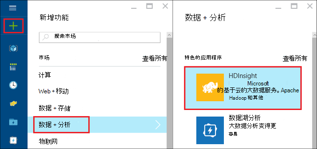
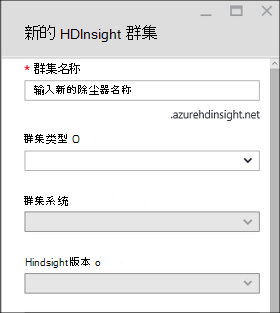
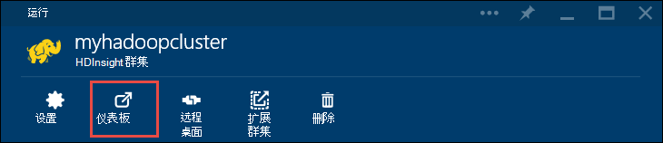

<properties
   pageTitle="Hadoop 教程︰ 开始使用 Hadoop 在 Windows |Microsoft Azure"
   description="开始使用 Hadoop HDInsight 中。 了解如何创建在 Windows 上的 Hadoop 群集、 运行配置单元查询数据，并分析在 Excel 中的输出。"
   keywords="hadoop 教程，在 windows 中，hadoop 群集的 hadoop 了解 hadoop，配置单元查询"
   services="hdinsight"
   documentationCenter=""
   authors="nitinme"
   manager="jhubbard"
   editor="cgronlun"
   tags="azure-portal"/>

<tags
   ms.service="hdinsight"
   ms.devlang="na"
   ms.topic="article"
   ms.tgt_pltfrm="na"
   ms.workload="big-data"
   ms.date="03/07/2016"
   ms.author="nitinme"/>

# Hadoop 教程︰ 在 HDInsight 在 Windows 中使用 Hadoop 开始

> [AZURE.SELECTOR]
- [基于 linux * 的](../hdinsight-hadoop-linux-tutorial-get-started.md)
- [基于 Windows 的](../hdinsight-hadoop-tutorial-get-started-windows.md)

为了帮助您了解 Windows 上的 Hadoop 并开始使用 HDInsight，本教程演示如何在 Hadoop 群集中的非结构化数据上运行配置单元查询和分析的结果在 Microsoft Excel 中。

>[AZURE.NOTE] 此文档中的信息是特定于基于 Windows HDInsight 群集。 基于 linux * 的群集的信息，请参阅[Hadoop 教程︰ 开始在 HDInsight 中使用基于 Linux 的 Hadoop](hdinsight-hadoop-linux-tutorial-get-started.md)。

假设您拥有大量的非结构化的数据集和要运行的配置单元查询以提取一些有意义的信息。 这正是您要不要在本教程中。 下面是如何达到此目的︰

   !["Hadoop 教程︰ 创建一个帐户;创建 Hadoop 群集;提交配置单元查询;分析在 Excel 中的数据。][image-hdi-getstarted-flow]

观看教程学习 Hadoop HDInsight 上的演示视频︰

![第一个的 Hadoop 教程的视频︰ 提交在 Hadoop 群集上，配置单元查询和分析在 Excel 中的结果。][img-hdi-getstarted-video]

**[在 YouTube 上的 HDInsight 监视 Hadoop 教程](https://www.youtube.com/watch?v=Y4aNjnoeaHA&list=PLDrz-Fkcb9WWdY-Yp6D4fTC1ll_3lU-QS)**

结合 Azure HDInsight 的一般可用性，Microsoft 还提供了 Azure，前身为*Microsoft HDInsight 开发者预览版*HDInsight 模拟器。 仿真程序开发人员方案的目标，只支持单节点部署。 有关使用 HDInsight 仿真程序的信息，请参阅[开始使用 HDInsight 仿真程序][hdinsight-emulator]。

[AZURE.INCLUDE [delete-cluster-warning](../../includes/hdinsight-delete-cluster-warning.md)]

## 系统必备组件

为 Windows 上的 Hadoop 开始本教程之前，您必须具有以下︰

- **Azure 订阅**。 请参阅[获取 Azure 免费试用版](https://azure.microsoft.com/documentation/videos/get-azure-free-trial-for-testing-hadoop-in-hdinsight/)。
- 与 Office 2013 专业加、 Office 365 专业人员加上、 Excel 2013 独立或 Office 2010 专业版加**一个工作站计算机**。

### 访问控制要求

[AZURE.INCLUDE [access-control](../../includes/hdinsight-access-control-requirements.md)]

##创建 Hadoop 群集

创建群集时，您将创建包含 Hadoop 和相关应用程序的 Azure 计算资源。 在本节中，您创建一个 HDInsight 3.2 版本的群集。 您还可以创建其他版本的 Hadoop 群集。 有关说明，请参阅[创建 HDInsight 群集使用自定义选项][hdinsight-provision]。 其服务级别协议和 HDInsight 版本有关的信息，请参阅[HDInsight 组件版本控制](hdinsight-component-versioning.md)。

**若要创建 Hadoop 群集**

1. 登录到[Azure 的门户](https://portal.azure.com/)。
2. 单击**新建**，单击**数据分析**，然后单击**HDInsight**。 门户将打开一个**新的 HDInsight 群集**叶片。

    

3. 输入或选择以下设置︰

    
    
  	|字段名称| 值|
  	|----------|------|
  	|群集名称| 一个唯一的名称，用于标识群集|
  	|群集类型| 选择用于本教程的**Hadoop** 。 |
  	|群集系统| 出于本教程选择**Windows Server 2012 R2 数据中心**。|
  	|HDInsight 版| 选择用于本教程的最新版本。|
  	|订阅| 选择将用于群集的 Azure 订阅。|
  	|资源组 | 选择一个现有的 Azure 资源组或创建新的资源组。 基本的 HDInsight 群集包含群集和其默认存储帐户。  您可以分组到一个资源组，以方便管理的两个。|
  	|凭据| 输入的群集的登录用户名和密码。 基于 Windows 群集还可有 2 的用户帐户。  群集用户 （或 HTTP 用户） 用来管理群集和提交作业。  您可以选择创建远程桌面 (RDP) 到远程用户帐户连接到群集。 如果您选择启用远程桌面，您将创建 RDP 的用户帐户。|
  	|数据源| 单击新建以创建新的默认 Azure 存储帐户。 群集名称用作默认容器名称。 每个 HDinsight 群集在 Azure 存储 accont 具有默认 Blob 容器。  默认 Azure 存储帐户的位置确定 HDInsight 群集的位置。|
  	|定价层的节点| 使用本教程定价层默认辅助节点和头注释 1 或 2 的辅助节点。|
  	|可选配置| 跳过此部分。|

9. **新的 HDInsight 群集**刀片式服务器，请确保**附到 Startboard**被选中，然后单击**创建**。 这会创建群集，并到 Azure 门户网站 Startboard 为其添加一个图块。 群集中创建，并将更改显示的 HDInsight 图标创建完成后，该图标将指示。

  	| 在创建过程 | 创建完成 |
  	| ------------------ | --------------------- |
  	|  |  |

    > [AZURE.NOTE] 它将需要一些时间为群集创建，通常大约 15 分钟。 使用 Startboard 或**通知**条目左侧的页上平铺上创建过程检查。

10. 完成创建后，单击 Startboard 启动群集刀片式服务器从群集的拼贴。

## 从门户网站上运行配置单元查询
现在，您已经创建了一个 HDInsight 群集下, 一步是运行查询的示例配置单元表的配置单元作业。 我们将使用*hivesampletable*，其中附带了 HDInsight 群集。 表中包含有关移动设备制造商、 平台和模型的数据。 此表中的配置单元查询检索特定制造商的移动设备的数据。

> [AZURE.NOTE] HDInsight 工具 Visual Studio.NET 版本 2.5 或更高版本的带有 Azure SDK。 在 Visual Studio 中使用的工具，您可以连接到 HDInsight 群集、 创建配置单元表并运行配置单元查询。 有关详细信息，请参阅[开始使用 Visual Studio 的 HDInsight Hadoop 工具][1]。

**要从群集控制板运行配置单元作业**

1. 登录到[Azure 的门户](https://portal.azure.com/)。
2. 单击**浏览全部**，然后单击**HDInsight 群集**的群集，包括刚才在上一节中创建的群集列表，请参阅。
3. 单击您想要使用运行配置单元作业中，该群集的名称，然后单击**面板**顶部的刀片式服务器。
4. 在不同的浏览器选项卡中打开网页。 输入的 Hadoop 的用户帐户和密码。 默认的用户名是**admin**;密码是在创建群集时输入的内容。
5. 从仪表板，请单击**配置单元编辑器**选项卡。 下面的 web 页将打开。

    ![在 HDInsight 群集仪表板配置单元编辑器选项卡。][img-hdi-dashboard]

    有几个选项卡页的顶部。 默认选项卡中为**配置单元编辑器**，以及其他选项卡是**作业历史记录**，**文件浏览器**。 通过使用仪表板，可以提交配置单元查询、 检查 Hadoop 作业日志，并浏览存储中的文件。

    > [AZURE.NOTE] 请注意，该网页的 URL 是*&lt;群集名称&gt;。 azurehdinsight.net*。 因此而不是从门户打开仪表板，可以使用 URL 来打开仪表板 web 浏览器中。

6. **配置单元编辑器**选项卡上，输入**查询名称**，输入**HTC20**。  该查询将职务。 在查询窗格中，输入配置单元查询，如图所示︰

    ![配置单元中的配置单元编辑器中的查询窗格中输入查询。][img-hdi-dashboard-query-select]

4. 单击**提交**。 花费一些时间来重新获得的结果。 屏幕刷新每隔 30 秒。 您还可以单击**刷新**来刷新屏幕。

    ![群集面板底部列出配置单元在查询的结果。][img-hdi-dashboard-query-select-result]

5. 状态显示在作业完成后，请单击在屏幕上查看输出的查询名称。 记下**作业开始时间 (UTC)**。 您将稍后需要它。

    ![作业开始时间 HDInsight 群集控制板的作业历史记录选项卡中列出。][img-hdi-dashboard-query-select-result-output]

    该页面还显示**作业输出**和**作业日志**。 您还可以选择将输出文件下载 (\_stdout) 和日志文件\(_stderr)。

**浏览到输出文件**

1. 在群集面板中，单击**文件浏览器**。
2. 单击您的存储帐户名称，单击容器名 （它是群集名称相同），然后单击**用户**。
3. 单击**管理员**，然后单击有上次的修改时间 （有点后作业开始的时间前面提到） 的 GUID。 复制此 GUID。 下一节中，您将需要它。

    ![配置单元查询输出的文件在文件浏览器选项卡中列出的 GUID。][img-hdi-dashboard-query-browse-output]

##对于 Excel 连接到 Microsoft 商业智能工具

您可以使用电源查询添加 Microsoft excel 从 HDInsight 的作业输出导入到 Excel 中，可以使用 Microsoft 商业智能工具来进一步分析结果。

您必须具有 Excel 2013 或 2010 安装完成本教程的这一部分。

**下载电源查询 Microsoft excel**

- Microsoft excel 从[Microsoft 下载中心](http://www.microsoft.com/download/details.aspx?id=39379)下载电源 Query 并安装它。

**HDInsight 数据导入**

1. 打开 Excel，并创建一个新工作簿。
3. 单击**电源查询**菜单，单击**自其他来源**，然后单击**从 Azure HDInsight**。

    ![Azure HDInsight 为打开的 Excel PowerQuery 导入菜单。][image-hdi-gettingstarted-powerquery-importdata]

3. 输入与群集，Azure Blob 存储帐户的**帐户名**，然后单击**确定**。 （这是先前在本教程中创建的存储帐户）。
4. Azure Blob 存储帐户，输入**帐户密码**，然后单击**保存**。
5. 在右窗格中，双击该 blob 名称。 默认情况下该 blob 名称是群集名称相同。

6. 在**名称**列中找到**标准输出**。 验证相应**文件夹路径**列中的 GUID 与先前复制的 GUID 相匹配。 匹配项表明输出数据对应于您提交的作业。 单击**二进制**列左侧的**标准输出**中。

    ![查找列表中的内容的 GUID 的数据输出。][image-hdi-gettingstarted-powerquery-importdata2]

9. 单击**关闭和负载**在左上角，以导入配置单元作业输出到 Excel 中。

##运行示例

HDInsight 群集提供了包括入门的库，可以直接从门户运行示例查询控制台。 可以使用示例来学习如何使用 HDInsight 来通过逐步介绍一些基本情况。 这些示例附带所有必需的组件，如要分析的数据和在数据上运行查询。 若要了解有关入门教程库中的示例的详细信息，请参阅[了解的 Hadoop HDInsight 使用 HDInsight 前已启动库中](hdinsight-learn-hadoop-use-sample-gallery.md)。

**若要运行该示例**

1. 从 Azure 门户 startboard 中，单击您刚创建的群集的拼贴。
 
2. 在新群集刀片式服务器，单击**仪表板**。 出现提示时，输入对群集的管理员用户名和密码。

    
 
3. 打开该网页，从**前已启动库**选项卡，然后**具有示例数据的解决方案**类别下，单击您想要运行该示例。 根据 Web 页后，可以完成此示例的说明。 下表列出了几个示例，并提供了有关哪些每个样本的作用的详细信息。

示例 | 其作用是什么？
------ | ---------------
[传感器数据分析][hdinsight-sensor-data-sample] | 了解如何使用 HDInsight 来处理产生的加热，通风，空调 (HVAC) 系统来识别系统不能可靠地维护设置温度的历史数据。
[网站日志分析][hdinsight-weblogs-sample] | 了解如何使用 HDInsight 来分析网站日志文件，以深入了解到网站外部网站，从一天的访问的频率以及用户体验的网站错误的摘要。
[Twitter 趋势分析](hdinsight-analyze-twitter-data.md) | 了解如何使用 HDInsight 来分析在 Twitter 趋势。

##删除群集

[AZURE.INCLUDE [delete-cluster-warning](../../includes/hdinsight-delete-cluster-warning.md)]

##下一步行动
在 Hadoop 教程中，您学习了如何在 HDInsight，运行配置单元查询数据，并导入到 Excel 中，它们可以被进一步的结果处理和使用商业智能工具以图形方式显示在中的窗口上创建 Hadoop 群集。 若要了解详细信息，请参阅下面的教程︰

- [开始使用 Visual Studio HDInsight Hadoop 工具][1]
- [HDInsight 仿真程序入门][hdinsight-emulator]
- [使用 HDInsight Azure Blob 存储][hdinsight-storage]
- [管理使用 PowerShell 的 HDInsight][hdinsight-admin-powershell]
- [将数据上传到 HDInsight][hdinsight-upload-data]
- [HDInsight 使用 MapReduce][hdinsight-use-mapreduce]
- [使用 HDInsight 配置单元][hdinsight-use-hive]
- [使用 HDInsight 的小猪][hdinsight-use-pig]
- [HDInsight 使用 Oozie][hdinsight-use-oozie]
- [HDInsight 为开发 Java MapReduce 程序][hdinsight-develop-mapreduce]

[1]: ../HDInsight/hdinsight-hadoop-visual-studio-tools-get-started.md

[hdinsight-versions]: hdinsight-component-versioning.md

[hdinsight-provision]: hdinsight-provision-clusters.md
[hdinsight-admin-powershell]: hdinsight-administer-use-powershell.md
[hdinsight-upload-data]: hdinsight-upload-data.md
[hdinsight-use-mapreduce]: hdinsight-use-mapreduce.md
[hdinsight-use-hive]: hdinsight-use-hive.md
[hdinsight-use-pig]: hdinsight-use-pig.md
[hdinsight-use-oozie]: hdinsight-use-oozie.md
[hdinsight-storage]: hdinsight-hadoop-use-blob-storage.md
[hdinsight-emulator]: hdinsight-hadoop-emulator-get-started.md
[hdinsight-develop-mapreduce]: hdinsight-develop-deploy-java-mapreduce-linux.md
[hadoop-hdinsight-intro]: hdinsight-hadoop-introduction.md
[hdinsight-weblogs-sample]: hdinsight-hive-analyze-website-log.md
[hdinsight-sensor-data-sample]: hdinsight-hive-analyze-sensor-data.md

[azure-purchase-options]: http://azure.microsoft.com/pricing/purchase-options/
[azure-member-offers]: http://azure.microsoft.com/pricing/member-offers/
[azure-free-trial]: http://azure.microsoft.com/pricing/free-trial/
[azure-management-portal]: https://portal.azure.com/
[azure-create-storageaccount]: ../storage-create-storage-account.md

[apache-hadoop]: http://go.microsoft.com/fwlink/?LinkId=510084
[apache-hive]: http://go.microsoft.com/fwlink/?LinkId=510085
[apache-mapreduce]: http://go.microsoft.com/fwlink/?LinkId=510086
[apache-hdfs]: http://go.microsoft.com/fwlink/?LinkId=510087
[hdinsight-hbase-custom-provision]: hdinsight-hbase-tutorial-get-started.md

[powershell-download]: http://go.microsoft.com/fwlink/p/?linkid=320376&clcid=0x409
[powershell-install-configure]: powershell-install-configure.md
[powershell-open]: powershell-install-configure.md#step-1-install

[img-hdi-dashboard]: ./media/hdinsight-hadoop-tutorial-get-started-windows/HDI.dashboard.png
[img-hdi-dashboard-query-select]: ./media/hdinsight-hadoop-tutorial-get-started-windows/HDI.dashboard.query.select.png
[img-hdi-dashboard-query-select-result]: ./media/hdinsight-hadoop-tutorial-get-started-windows/HDI.dashboard.query.select.result.png
[img-hdi-dashboard-query-select-result-output]: ./media/hdinsight-hadoop-tutorial-get-started-windows/HDI.dashboard.query.select.result.output.png
[img-hdi-dashboard-query-browse-output]: ./media/hdinsight-hadoop-tutorial-get-started-windows/HDI.dashboard.query.browse.output.png

[img-hdi-getstarted-video]: ./media/hdinsight-hadoop-tutorial-get-started-windows/hdi-get-started-video.png

[image-hdi-storageaccount-quickcreate]: ./media/hdinsight-hadoop-tutorial-get-started-windows/HDI.StorageAccount.QuickCreate.png
[image-hdi-clusterstatus]: ./media/hdinsight-hadoop-tutorial-get-started-windows/HDI.ClusterStatus.png
[image-hdi-quickcreatecluster]: ./media/hdinsight-hadoop-tutorial-get-started-windows/HDI.QuickCreateCluster.png
[image-hdi-getstarted-flow]: ./media/hdinsight-hadoop-tutorial-get-started-windows/HDI.GetStartedFlow.png

[image-hdi-gettingstarted-powerquery-importdata]: ./media/hdinsight-hadoop-tutorial-get-started-windows/HDI.GettingStarted.PowerQuery.ImportData.png
[image-hdi-gettingstarted-powerquery-importdata2]: ./media/hdinsight-hadoop-tutorial-get-started-windows/HDI.GettingStarted.PowerQuery.ImportData2.png
 
