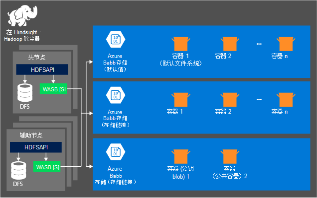
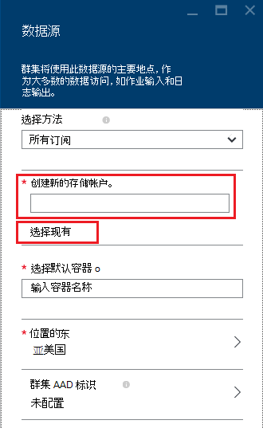

<properties
    pageTitle="通过兼容 HDFS Blob 存储查询数据 |Microsoft Azure"
    description="HDInsight 使用 Azure Blob 存储作为 HDFS 的大数据存储区。 学习如何查询数据的 Blob 存储和存储您的分析结果。"
    keywords="blob 存储，hdfs、 结构化的数据和非结构化的数据"
    services="hdinsight,storage"
    documentationCenter=""
    tags="azure-portal"
    authors="mumian"
    manager="jhubbard"
    editor="cgronlun"/>

<tags
    ms.service="hdinsight"
    ms.workload="big-data"
    ms.tgt_pltfrm="na"
    ms.devlang="na"
    ms.topic="get-started-article"
    ms.date="09/06/2016"
    ms.author="jgao"/>

# 使用 Hadoop 在 HDInsight 兼容 HDFS Azure Blob 存储

了解如何使用 HDInsight 的低成本 Azure Blob 存储、 创建 Azure 存储帐户和 Blob 存储容器，然后地址中的数据。

Azure Blob 存储是一种可靠、 通用的存储解决方案，与 HDInsight 无缝集成。 通过 Hadoop 分布式的文件系统 (HDFS) 接口，HDInsight 中的组件的完整集可以直接应用于 Blob 存储中的结构化或非结构化数据。

在 Blob 存储中存储的数据使您可以安全地删除而不会丢失用户的数据用于计算 HDInsight 群集。

> [AZURE.IMPORTANT] HDInsight 仅支持块 blob。 它不支持页面或追加 blob。

有关创建 HDInsight 群集的信息，请参阅[开始使用 HDInsight] [ hdinsight-get-started] [HDInsight 创建群集]或[hdinsight-creation]。

## HDInsight 存储体系结构
下图提供了 HDInsight 存储体系结构的抽象视图︰

HDInsight 提供对本地挂接到计算节点的分布式的文件系统的访问。 例如通过使用完全限定的 URI 中，可以访问此文件系统︰

    hdfs://<namenodehost>/<path>

此外，HDInsight 还提供了访问 Azure Blob 存储中存储的数据的能力。 语法是︰

    wasb[s]://<containername>@<accountname>.blob.core.windows.net/<path>

> [AZURE.NOTE] 在早于 3.0 版本的 HDInsight`asv://`而不是使用了`wasb://`。 `asv://`不应使用 HDInsight 群集 3.0 或更高，因为它会导致错误。

Hadoop 支持缺省文件系统的概念。 默认的文件系统表示默认的方案和机构。 它还可以用于解析相对路径。 在 HDInsight 的创建过程，Azure 存储帐户和特定的 Azure Blob 存储过程容器从该帐户被指定为默认的文件系统中。

除了此存储帐户，可以添加更多存储帐户从 Azure 的订阅相同或不同的 Azure 预订创建过程中或在创建群集之后。 有关添加更多存储帐户的说明，请参阅[创建 HDInsight 群集][hdinsight-creation]。

- **容器中存储帐户连接到群集︰**由于在创建过程中会与群集相关联的帐户名称和密钥，您拥有完全访问这些容器中的 blob。

- **公共容器或未连接到群集的存储帐户中的公钥 blob:**具有只读权限的容器中的 blob。

    > [AZURE.NOTE]
        > 公共容器允许您获取的所有 blob，可用该容器中获取元数据容器列表。 公共 blob 允许您访问 blob，才知道正确的 URL。 有关详细信息，请参阅<a href="http://msdn.microsoft.com/library/windowsazure/dd179354.aspx">限制对容器和 blob 的访问</a>。

- **专用容器中没有连接到群集的存储帐户︰**除非当您提交的 WebHCat 作业定义存储帐户，否则无法访问 blob 容器中。 在本文稍后部分讲述。

在创建过程和相应的键定义的存储帐户存储在群集节点上的 %HADOOP_HOME%/conf/core-site.xml。 HDInsight 的默认行为是使用核心 site.xml 文件中定义的存储帐户。 建议不要编辑核心 site.xml 文件，因为可能重新映像或在任何时候，迁移群集头 node(master)，并对这些文件的任何更改都将丢失。

多个 WebHCat 作业，包括配置单元、 MapReduce，Hadoop 流和小猪，可以执行存储帐户和使用这些元数据的说明。 （此当前适用有关猪的存储帐户，而不是元数据。在本文的[使用 Azure PowerShell 访问 blob](#powershell)部分中，则此功能的示例。 有关详细信息，请参阅[使用带有备用存储帐户和 Metastores HDInsight 群集](http://social.technet.microsoft.com/wiki/contents/articles/23256.using-an-hdinsight-cluster-with-alternate-storage-accounts-and-metastores.aspx)。

Blob 存储可以用于结构化和非结构化数据。 Blob 存储容器的键/值对的形式存储数据，并且没有任何目录层次结构。 但是斜杠字符 （/） 可以用于中的键名，以使其出现如同文件存储在目录结构中。 例如，某个 blob 密钥可能*input/log1.txt*。 没有实际*输入*的目录存在，但是斜杠字符键名称的存在，由于它具有文件路径的外观。

###Blob 存储的好处
不共存的隐含的性能开销计算群集和存储资源，可以减少计算群集接近内 Azure 的地区，其中高速网络使得它非常有效的计算节点访问 Azure Blob 存储中的数据的存储帐户资源的创建顺便说一句。

有几个优点，而不是 HDFS Azure Blob 存储中存储的数据与相关联︰

* **数据重用和共享︰**在 HDFS 数据位于内部计算群集。 有权访问计算群集的应用程序可以通过使用 HDFS Api 使用数据。 Azure Blob 存储中的数据可以通过 HDFS Api 或[Blob 存储 REST Api]访问[blob-storage-restAPI]。 因此，大型数据集 （包括其他 HDInsight 群集） 的应用程序和工具可以用于生成和使用数据。
* **数据存档︰**在 Azure Blob 存储中存储的数据可以用于计算要安全地删除而不会丢失用户数据的 HDInsight 群集。
* **数据存储成本︰**长期存储在 DFS 中的数据是 Azure Blob 存储中存储的数据，由于计算群集的成本高于 Azure Blob 存储容器的成本比成本更高。 此外，由于数据不需要为每个计算群集代重新加载，您正在保存数据加载成本。
* **弹性扩张︰**HDFS 为您提供了一个扩展的文件系统，虽然比例取决于您为群集创建的节点数。 更改比例会变得依赖缩放功能，自动获得在 Azure Blob 存储弹性比一个更复杂的过程。
* **地区复制︰**Azure Blob 存储载体可以是地理复制。 虽然这样可以地理恢复和数据冗余，故障切换到地区复制位置会严重影响性能，并且它可能会导致额外的成本。 因此我们建议是明智的选择地区复制，只有当数据的价值是值得额外的成本。

某些 MapReduce 作业和软件包可能会产生您确实不需要在 Azure Blob 存储中存储的中间结果。 在这种情况下，您可以选择将数据存储在本地 HDFS。 事实上，HDInsight 使用 DFS 的几个配置单元作业和其他进程中这些中间结果。

> [AZURE.NOTE] 大多数 HDFS 命令 （例如， <b>ls</b>、 <b>copyFromLocal</b>和<b>mkdir</b>） 仍按预期方式工作。 仅适用于本机 HDFS 实现 （这被称为 DFS），如<b>fschk</b>和<b>dfsadmin</b>，命令将 Azure Blob 存储中显示不同的行为。

## 创建 Blob 容器

若要使用 blob，您首先创建一个[Azure 存储帐户][azure-storage-create]。 此过程中，指定要存储的对象，您将使用此帐户创建一个 Azure 区域。 群集和存储帐户必须在相同区域中托管。 配置单元 metastore SQL Server 数据库和 Oozie metastore SQL Server 数据库也必须位于同一区域中。

只要它存在，您创建的每个 blob 所属在 Azure 存储帐户的容器。 此容器可能超出 HDInsight，创建现有 blob 或它可能为 HDInsight 群集创建一个容器。

默认的 Blob 容器存储群集特定信息，如作业历史记录日志和日志。 不要使用多个 HDInsight 群集共享默认 Blob 容器。 这可能会破坏作业历史记录，并且群集将异常行为。 建议为每个群集使用不同容器并放在部署中的所有相关的群集，而不是默认的存储帐户指定链接的存储帐户共享的数据。 配置链接的存储帐户的详细信息，请参阅[群集创建 HDInsight][hdinsight-creation]。 删除原 HDInsight 群集之后，但是可以重复使用默认存储容器。 HBase 群集，您实际上可以保留 HBase 表架构和数据创建新的 HBase 群集使用默认 blob 存储容器使用 HBase 群集中被删除的。

### 使用 Azure 门户

从门户创建一个 HDInsight 群集，必须使用现有的存储帐户或创建新的存储帐户的选项︰

###使用 Azure CLI

[AZURE.INCLUDE [use-latest-version](../../includes/hdinsight-use-latest-cli.md)]

如果您有[安装和配置 Azure CLI](../xplat-cli-install.md)，可以对存储帐户和容器使用下面的命令。

    azure storage account create <storageaccountname> --type LRS

> [AZURE.NOTE] `--type`参数指示复制存储帐户的方式。 有关详细信息，请参阅[Azure 存储复制](../storage/storage-redundancy.md)。 不使用 ZRS ZRS 不支持页面 blob、 文件、 表或队列。

系统将提示您指定将位于存储帐户的地理区域。 应在同一区域，您计划创建 HDInsight 群集创建存储帐户。

创建存储帐户后，使用以下命令检索存储帐户密钥︰

    azure storage account keys list <storageaccountname>

若要创建一个容器，请使用下面的命令︰

    azure storage container create <containername> --account-name <storageaccountname> --account-key <storageaccountkey>

### 使用 Azure PowerShell

如果您[安装并配置 Azure PowerShell][powershell-install]，您可以使用从 Azure PowerShell 提示符下创建存储帐户和容器︰

[AZURE.INCLUDE [upgrade-powershell](../../includes/hdinsight-use-latest-powershell.md)]

    $SubscriptionID = "<Your Azure Subscription ID>"
    $ResourceGroupName = "<New Azure Resource Group Name>"
    $Location = "EAST US 2"
    
    $StorageAccountName = "<New Azure Storage Account Name>"
    $containerName = "<New Azure Blob Container Name>"
    
    Add-AzureRmAccount
    Select-AzureRmSubscription -SubscriptionId $SubscriptionID
    
    # Create resource group
    New-AzureRmResourceGroup -name $ResourceGroupName -Location $Location
    
    # Create default storage account
    New-AzureRmStorageAccount -ResourceGroupName $ResourceGroupName -Name $StorageAccountName -Location $Location -Type Standard_LRS 
    
    # Create default blob containers
    $storageAccountKey = (Get-AzureRmStorageAccountKey -ResourceGroupName $resourceGroupName -StorageAccountName $StorageAccountName)[0].Value
    $destContext = New-AzureStorageContext -StorageAccountName $storageAccountName -StorageAccountKey $storageAccountKey  
    New-AzureStorageContainer -Name $containerName -Context $destContext

## 在 Blob 存储地址文件

从 HDInsight 访问 Blob 存储中的文件的 URI 方案是︰

    wasb[s]://<BlobStorageContainerName>@<StorageAccountName>.blob.core.windows.net/<path>

URI 方案提供不加密的访问 (与*wasb:*前缀) 和 SSL 加密 （使用*wasbs*) 的访问。 我们建议使用*wasbs* ，在可能的情况下，即使在 Azure 中的同一个区域内居住的数据访问。

&lt;BlobStorageContainerName&gt;标识 Azure Blob 存储在容器的名称。
&lt;StorageAccountName&gt;标识的 Azure 存储帐户名称。 完全限定的域名称 (FQDN) 是必需的。

如果既没有&lt;BlobStorageContainerName&gt;和&lt;StorageAccountName&gt;已指定，则使用默认的文件系统。 默认的文件系统上的文件，可以使用相对路径或绝对路径。 例如，使用以下方法之一被称为附带了 HDInsight 群集的*hadoop 的 mapreduce examples.jar*文件︰

    wasbs://mycontainer@myaccount.blob.core.windows.net/example/jars/hadoop-mapreduce-examples.jar
    wasbs:///example/jars/hadoop-mapreduce-examples.jar
    /example/jars/hadoop-mapreduce-examples.jar

> [AZURE.NOTE] 文件名称是<i>hadoop examples.jar</i> HDInsight 2.1 和 1.6 版本的群集中。

&lt;路径&gt;是文件或目录 HDFS 的路径名称。 由于在 Azure Blob 存储容器只是键 / 值存储，没有真正的层级结构文件系统。 Blob 键里的斜杠字符 （/） 被解释为一个目录分隔符。 例如， *hadoop 的 mapreduce-examples.jar*的 blob 名称是︰

    example/jars/hadoop-mapreduce-examples.jar

> [AZURE.NOTE] 当使用 blob HDInsight 之外，大多数的实用程序不知道 WASB 格式和相反期望基本路径的格式，如`example/jars/hadoop-mapreduce-examples.jar`。

## 使用 Azure CLI 访问 blob

使用以下命令列出的 blob 相关的命令︰

    azure storage blob

**使用 Azure CLI 上载的文件的示例**

    azure storage blob upload <sourcefilename> <containername> <blobname> --account-name <storageaccountname> --account-key <storageaccountkey>

**使用 Azure CLI 下载文件的示例**

    azure storage blob download <containername> <blobname> <destinationfilename> --account-name <storageaccountname> --account-key <storageaccountkey>

**使用 Azure CLI 删除文件的示例**

    azure storage blob delete <containername> <blobname> --account-name <storageaccountname> --account-key <storageaccountkey>

**列出文件使用 Azure CLI 的示例**

    azure storage blob list <containername> <blobname|prefix> --account-name <storageaccountname> --account-key <storageaccountkey>

## 使用 Azure PowerShell 访问 blob

> [AZURE.NOTE] 本节中的命令提供了访问数据的 blob 存储使用 PowerShell 的基本示例。 为使用 HDInsight 自定义一个更完备的示例，请参见[HDInsight 工具](https://github.com/Blackmist/hdinsight-tools)。

使用以下命令列出的 blob 相关 cmdlet:

    Get-Command *blob*

![Blob 相关 PowerShell cmdlet 的列表。][img-hdi-powershell-blobcommands]

###上载文件

请参阅[上载数据为 HDInsight][hdinsight-upload-data]。

###下载文件

以下脚本下载到当前文件夹块斑点。 之前运行该脚本，请将目录更改到文件夹具有写权限的位置。

    $resourceGroupName = "<AzureResourceGroupName>"
    $storageAccountName = "<AzureStorageAccountName>"   # The storage account used for the default file system specified at creation.
    $containerName = "<BlobStorageContainerName>"  # The default file system container has the same name as the cluster.
    $blob = "example/data/sample.log" # The name of the blob to be downloaded.
    
    # Use Add-AzureAccount if you haven't connected to your Azure subscription
    Login-AzureRmAccount 
    Select-AzureRmSubscription -SubscriptionID "<Your Azure Subscription ID>"
    
    Write-Host "Create a context object ... " -ForegroundColor Green
    $storageAccountKey = (Get-AzureRmStorageAccountKey -ResourceGroupName $resourceGroupName -Name $storageAccountName)[0].Value
    $storageContext = New-AzureStorageContext -StorageAccountName $storageAccountName -StorageAccountKey $storageAccountKey  
    
    Write-Host "Download the blob ..." -ForegroundColor Green
    Get-AzureStorageBlobContent -Container $ContainerName -Blob $blob -Context $storageContext -Force
    
    Write-Host "List the downloaded file ..." -ForegroundColor Green
    cat "./$blob"

提供的资源组名称和群集名称，您可以使用下面的代码︰

    $resourceGroupName = "<AzureResourceGroupName>"
    $clusterName = "<HDInsightClusterName>"
    $blob = "example/data/sample.log" # The name of the blob to be downloaded.
    
    $cluster = Get-AzureRmHDInsightCluster -ResourceGroupName $resourceGroupName -ClusterName $clusterName
    $defaultStorageAccount = $cluster.DefaultStorageAccount -replace '.blob.core.windows.net'
    $defaultStorageAccountKey = (Get-AzureRmStorageAccountKey -ResourceGroupName $resourceGroupName -Name $defaultStorageAccount)[0].Value
    $defaultStorageContainer = $cluster.DefaultStorageContainer
    $storageContext = New-AzureStorageContext -StorageAccountName $defaultStorageAccount -StorageAccountKey $defaultStorageAccountKey 
    
    Write-Host "Download the blob ..." -ForegroundColor Green
    Get-AzureStorageBlobContent -Container $defaultStorageContainer -Blob $blob -Context $storageContext -Force

###删除文件

    Remove-AzureStorageBlob -Container $containerName -Context $storageContext -blob $blob

###文件列表

    Get-AzureStorageBlob -Container $containerName -Context $storageContext -prefix "example/data/"

###运行配置单元查询使用的是未定义的存储帐户

此示例演示如何列出的文件夹中创建的过程中未定义的存储帐户。
$clusterName ="<HDInsightClusterName>"

    $undefinedStorageAccount = "<UnboundedStorageAccountUnderTheSameSubscription>"
    $undefinedContainer = "<UnboundedBlobContainerAssociatedWithTheStorageAccount>"

    $undefinedStorageKey = Get-AzureStorageKey $undefinedStorageAccount | %{ $_.Primary }

    Use-AzureRmHDInsightCluster $clusterName

    $defines = @{}
    $defines.Add("fs.azure.account.key.$undefinedStorageAccount.blob.core.windows.net", $undefinedStorageKey)

    Invoke-AzureRmHDInsightHiveJob -Defines $defines -Query "dfs -ls wasbs://$undefinedContainer@$undefinedStorageAccount.blob.core.windows.net/;"

## 下一步行动

在本文中，您学习了如何使用 HDInsight，兼容 HDFS Azure Blob 存储，您学习了 Azure Blob 存储是 HDInsight 的基本组件。 这允许您构建可扩展的、 长期的存档数据采集 Azure Blob 存储解决方案并使用 HDInsight 来解锁该存储结构化和非结构化数据中的信息。

有关详细信息，请参阅︰

* [开始使用 Azure HDInsight][hdinsight-get-started]
* [将数据上传到 HDInsight][hdinsight-upload-data]
* [使用 HDInsight 配置单元][hdinsight-use-hive]
* [使用 HDInsight 的小猪][hdinsight-use-pig]
* [使用 Azure 存储共享访问签名限制访问的数据与 HDInsight][hdinsight-use-sas]

[hdinsight-use-sas]: hdinsight-storage-sharedaccesssignature-permissions.md
[powershell-install]: ../powershell-install-configure.md
[hdinsight-creation]: hdinsight-provision-clusters.md
[hdinsight-get-started]: hdinsight-hadoop-tutorial-get-started-windows.md
[hdinsight-upload-data]: hdinsight-upload-data.md
[hdinsight-use-hive]: hdinsight-use-hive.md
[hdinsight-use-pig]: hdinsight-use-pig.md

[blob-storage-restAPI]: http://msdn.microsoft.com/library/windowsazure/dd135733.aspx
[azure-storage-create]: ../storage/storage-create-storage-account.md

[img-hdi-powershell-blobcommands]: ./media/hdinsight-hadoop-use-blob-storage/HDI.PowerShell.BlobCommands.png
[img-hdi-quick-create]: ./media/hdinsight-hadoop-use-blob-storage/HDI.QuickCreateCluster.png
[img-hdi-custom-create-storage-account]: ./media/hdinsight-hadoop-use-blob-storage/HDI.CustomCreateStorageAccount.png  
