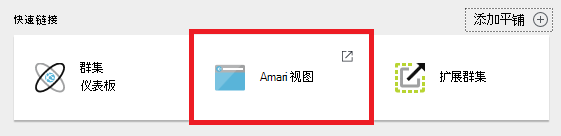
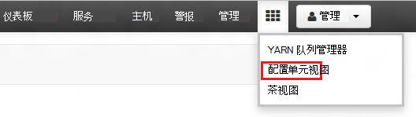
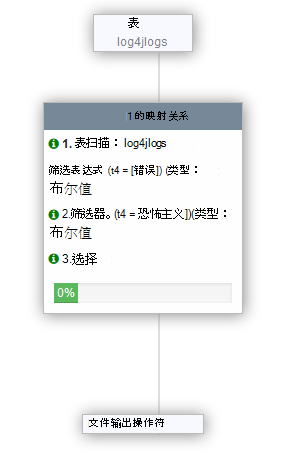

<properties
   pageTitle="使用 Ambari 视图来处理的 HDInsight (Hadoop) 上的配置单元 |Microsoft Azure"
   description="了解如何使用 web 浏览器中的配置单元视图提交配置单元查询。 配置单元视图是使用基于 Linux 的 HDInsight 群集提供的 Ambari Web 用户界面的一部分。"
   services="hdinsight"
   documentationCenter=""
   authors="Blackmist"
   manager="jhubbard"
   editor="cgronlun"
    tags="azure-portal"/>

<tags
   ms.service="hdinsight"
   ms.devlang="na"
   ms.topic="article"
   ms.tgt_pltfrm="na"
   ms.workload="big-data"
   ms.date="10/28/2016"
   ms.author="larryfr"/>

#使用 Hadoop HDInsight 中的视图中配置单元

[AZURE.INCLUDE [hive-selector](../../includes/hdinsight-selector-use-hive.md)]

Ambari 是一个管理和监视的实用程序提供的基于 Linux 的 HDInsight 群集。 通过 Ambari 提供的功能之一是一个 Web 用户界面，可用于运行配置单元查询。 这是__配置单元视图__，使用 HDInsight 群集提供的 Ambari 视图的一部分。

> [AZURE.NOTE] Ambari 有很多不在本文档中讨论的能力。 有关详细信息，请参阅[管理 HDInsight 群集使用 Ambari Web 用户界面](hdinsight-hadoop-manage-ambari.md)。

##系统必备组件

- 基于 linux * 的 HDInsight 群集。 有关创建新群集的信息，请参阅[开始使用基于 Linux 的 HDInsight](hdinsight-hadoop-linux-tutorial-get-started.md)。

##打开配置单元视图

您可以从 Azure 门户; Ambari 视图选择 HDInsight 群集，然后从__快速链接__部分中选择__Ambari 视图__。

可以直接定位到 Ambari 转到 web 浏览器中的 https://CLUSTERNAME.azurehdinsight.net （其中，__群集名称__是 HDInsight 群集的名称），并再将方块集选择从页面菜单 （旁边的__管理__链接和按钮在页面的左边） 可用视图的列表。 选择__配置单元视图__。

.

> [AZURE.NOTE] 在访问 Ambari 时，将提示您要对站点进行身份验证。 输入 admin (默认`admin`，) 帐户名称和密码在创建群集时使用。

您应该看到类似以下的页︰

##查看表

在页上的__数据库资源管理器__部分中，选择__数据库__选项卡上的__默认__条目。 这将显示默认数据库中的表的列表。 新 HDInsight 群集，应该存在一个表;__hivesampletable__。

为新表将添加到此文档中的步骤，可以使用数据库资源管理器右上角刷新图标来刷新可用表的列表。

##查询编辑器

使用以下步骤，可从配置单元视图可以对群集中包含的数据运行配置单元查询。

1. 在页上的__查询编辑器__部分中，将下面的 HiveQL 语句粘贴到工作表中︰

        DROP TABLE log4jLogs;
        CREATE EXTERNAL TABLE log4jLogs(t1 string, t2 string, t3 string, t4 string, t5 string, t6 string, t7 string)
        ROW FORMAT DELIMITED FIELDS TERMINATED BY ' '
        STORED AS TEXTFILE LOCATION 'wasbs:///example/data/';
        SELECT t4 AS sev, COUNT(*) AS cnt FROM log4jLogs WHERE t4 = '[ERROR]' GROUP BY t4;

    这些语句执行以下操作︰

    - **除去表**-删除表和数据文件，以防表已存在。
    - **创建外部表**-在配置单元中创建一个新的"外部"表。 外部表将只表定义存储在配置单元;将数据留在原来的位置。
    - **行格式**的说明配置单元设置数据的格式。 在这种情况下，由空格分隔每个日志中的字段。
    - **存储作为文本文件位置**-告诉配置单元数据的存储 （示例中的数据目录），并且它将存储为文本。
    - **选择**选择所有列 t4 其中包含值 [错误] 的行数。

    >[AZURE.NOTE] 期望通过外部源，例如自动化的数据上载过程中，或者通过 MapReduce 的另一个操作，更新基础数据时，应使用外部表，但总要配置单元查询使用最新的数据。 删除外部表 does*不*删除数据，仅表定义。

2. 使用查询编辑器的底部 [__执行__] 按钮来启动查询。 它应该变成胡萝卜和文本将变为__停止执行__。 __查询进程结果__部分应当显示在查询编辑器下方，显示有关作业的信息。

    > [AZURE.IMPORTANT] 某些浏览器不正确刷新日志或结果的信息。 如果运行作业时，它似乎永远运行而不会更新记录或返回结果，请尝试改用 Mozilla FireFox 或 Google Chrome。

3. 一旦完成查询，__查询过程结果__部分将显示操作的结果。 __停止执行__按钮还会改回绿色的__执行__按钮。 __结果__选项卡应包含以下信息︰

        sev       cnt
        [ERROR]   3

    __日志__选项卡可用于查看作业创建的日志记录信息。 可以使用此疑难解答如果有问题的查询。

    > [AZURE.TIP] 请注意在左上角的__查询过程结果__部分，则__保存结果__下拉列表可以使用此结果，下载或将其保存为 CSV 文件的 HDInsight 存储。

3. 选择此查询中，前四行，然后选择__执行__。 请注意在作业完成时没有任何结果。 这是因为使用 [__执行__] 按钮，选择查询的一部分时才会运行选定的语句。 在这种情况下，所选内容不包括最后一条语句从表中检索行。 如果您选择只是该行并使用__执行__，您应该看到了期望的结果。

3. 使用__查询编辑器__底部的__新建工作表__按钮来创建一个新工作表。 在新的工作表中输入下面的 HiveQL 语句︰

        CREATE TABLE IF NOT EXISTS errorLogs (t1 string, t2 string, t3 string, t4 string, t5 string, t6 string, t7 string) STORED AS ORC;
        INSERT OVERWRITE TABLE errorLogs SELECT t1, t2, t3, t4, t5, t6, t7 FROM log4jLogs WHERE t4 = '[ERROR]';

    这些语句执行以下操作︰

    - 如果不存在，则**创建表如果不存在**-创建一个表。 由于不使用**外部**关键字，则这种内部表，它存储在配置单元数据仓库和完全由配置单元。 与外部表，除去内部的表将删除基础数据。
    - **存储 AS ORC**的优化行纵栏式 (ORC) 格式存储的数据。 这是用于存储配置单元数据的高度优化和有效格式。
    - **插入覆盖...选择**-从包含 [错误] 的**log4jLogs**表中选择行并**errorLogs**表中插入数据。

    使用 [__执行__] 按钮来运行此查询。 为此查询，会返回任何行，但状态应显示为__成功__，__结果__选项卡将不包含任何信息。

###配置单元设置

选择右侧的编辑器中__设置__图标。

设置可用来更改各种配置单元设置，例如更改为从 Tez （默认值），配置单元的执行引擎的 MapReduce。

###介绍了可视化

选择__视觉解释__图标编辑器的右侧。

这是__视觉的解释__有助于了解流的复杂查询的查询视图。 通过使用查询编辑器中的__解释__按钮，您可以查看该视图的文本等效项。

###Tez

选择编辑器的右侧的__Tez__图标。

如果有的话，这将显示定向非循环图 (DAG) 对于此查询，使用 Tez。 如果您想要查看的查询 DAG 已经运行在过去或调试 Tez 过程中，通过使用[Tez 视图](hdinsight-debug-ambari-tez-view.md)相反。

###通知

选择__通知__图标编辑器的右侧。

通知是在运行查询时生成的消息。 例如，您将收到通知，提交查询时，或发生错误时。

##已保存的查询

1. 从查询编辑器中，创建一个新工作表，并输入下面的查询︰

        SELECT * from errorLogs;

    执行查询以验证它正常工作。 结果将如下所示︰

        errorlogs.t1    errorlogs.t2    errorlogs.t3    errorlogs.t4    errorlogs.t5    errorlogs.t6    errorlogs.t7
        2012-02-03  18:35:34    SampleClass0    [ERROR]     incorrect   id  
        2012-02-03  18:55:54    SampleClass1    [ERROR]     incorrect   id  
        2012-02-03  19:25:27    SampleClass4    [ERROR]     incorrect   id

2. 使用编辑器底部的__另存为__按钮。 此查询__Errorlogs__命名，并选择__确定__。 请注意，工作表的名称更改为__Errorlogs__。

3. 选择__已保存的查询__选项卡配置单元查看页面的顶部。 请注意， __Errorlogs__现在被列为已保存的查询。 会保持在此列表中，直至您将其删除。 选择名称将打开查询在查询编辑器中。

##查询历史记录

在配置单元视图顶部的__历史__按钮允许您查看查询，您可以运行以前。 现在，选择您的查询的一些先前运行，请使用它。 当您选择一个查询时，它将打开它在查询编辑器中。

##用户定义的函数 (UDF)

配置单元也可通过**用户定义函数 (UDF)**进行扩展。 UDF 可以在 HiveQL 中实现功能或逻辑，不很容易建立模型。

虽然在查询中，可作为 HiveQL 语句的一部分添加 UDF，UDF 选项卡顶部的配置单元视图可以声明并保存一套可用于__查询编辑器__的 Udf。

一旦对配置单元视图添加 UDF，__插入 udf__中的按钮将显示在__查询编辑器__的底部。 如果选择此将显示定义在视图中配置单元的 Udf 的下拉列表。 选择 UDF 将添加到查询中，以启用 UDF 的 HiveQL 语句。

例如，如果您定义具有以下属性的 UDF:

* 资源名称︰ myudfs
* 资源路径︰ wasbs:///myudfs.jar
* UDF 名称︰ myawesomeudf
* UDF 类名称︰ com.myudfs.Awesome

使用__插入 udf__按钮将显示一个名为__myudfs__，与每个 UDF 定义该资源的另一个下拉列表词条。 在此情况下， __myawesomeudf__。 选择此项将添加以下查询开始︰

    add jar wasbs:///myudfs.jar;

    create temporary function myawesomeudf as 'com.myudfs.Awesome';

然后，您可以在查询中使用 UDF。 例如， `SELECT myawesomeudf(name) FROM people;`。

在 Udf 中使用 HDInsight 配置单元的详细信息，请参阅以下资源︰

* [配置单元和猪的 HDInsight 中使用 Python](hdinsight-python.md)

* [如何将自定义的配置单元 UDF 添加到 HDInsight](http://blogs.msdn.com/b/bigdatasupport/archive/2014/01/14/how-to-add-custom-hive-udfs-to-hdinsight.aspx)

##下一步行动

HDInsight 中的配置单元的一般信息︰

* [使用 Hadoop HDInsight 上配置单元](hdinsight-use-hive.md)

有关其他方法的信息可以使用 Hadoop HDInsight 上︰

* [使用 Hadoop HDInsight 上的小猪](hdinsight-use-pig.md)

* [在 HDInsight 上的 Hadoop 使用 MapReduce](hdinsight-use-mapreduce.md)
