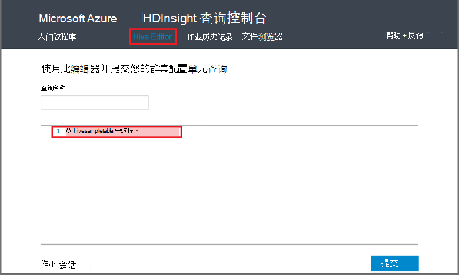

<properties
   pageTitle="在 HDInsight 中的查询控制台上使用 Hadoop 配置单元 |Microsoft Azure"
   description="了解如何使用基于 web 的查询控制台运行 HDInsight Hadoop 群集配置单元查询从您的浏览器。"
   services="hdinsight"
   documentationCenter=""
   authors="Blackmist"
   manager="jhubbard"
   editor="cgronlun"
    tags="azure-portal"/>

<tags
   ms.service="hdinsight"
   ms.devlang="na"
   ms.topic="article"
   ms.tgt_pltfrm="na"
   ms.workload="big-data"
   ms.date="09/20/2016"
   ms.author="larryfr"/>

# 运行配置单元查询使用查询控制台

[AZURE.INCLUDE [hive-selector](../../includes/hdinsight-selector-use-hive.md)]

在本文中，您将学习如何使用 HDInsight 查询控制台运行 HDInsight Hadoop 群集配置单元查询从您的浏览器。

> [AZURE.IMPORTANT] HDInsight 查询控制台才可用在基于 Windows 的 HDInsight 群集上。 如果您正在使用基于 Linux 的 HDInsight 群集，请参阅[使用配置单元视图运行配置单元的查询](hdinsight-hadoop-use-hive-ambari-view.md)。

##系统必备组件

若要完成本文中的步骤操作，您需要。

* 基于 Windows 的 HDInsight Hadoop 群集

* 现代 web 浏览器

##运行配置单元查询使用查询控制台

1. 打开 web 浏览器，然后定位到__https://CLUSTERNAME.azurehdinsight.net__，其中__群集名称__是 HDInsight 群集的名称。 如果出现提示，请输入用户名和创建群集时使用的密码。

2. 从页面顶部的链接，选择**配置单元编辑器**。 这将显示一个窗体，可用于输入您想要在 HDInsight 群集中运行的 HiveQL 语句。

    

    替换文字`Select * from hivesampletable`与下面的 HiveQL 语句︰

        set hive.execution.engine=tez;
        DROP TABLE log4jLogs;
        CREATE EXTERNAL TABLE log4jLogs (t1 string, t2 string, t3 string, t4 string, t5 string, t6 string, t7 string)
        ROW FORMAT DELIMITED FIELDS TERMINATED BY ' '
        STORED AS TEXTFILE LOCATION 'wasbs:///example/data/';
        SELECT t4 AS sev, COUNT(*) AS count FROM log4jLogs WHERE t4 = '[ERROR]' AND INPUT__FILE__NAME LIKE '%.log' GROUP BY t4;

    这些语句执行以下操作︰

    * **除去表**︰ 删除的表和数据文件，如果表已存在。
    * **创建外部表**︰ 在配置单元中创建一个新的外部表。 外部表将只表定义存储在配置单元;将数据留在原来的位置。

    > [AZURE.NOTE] 期望通过外部源 （如自动化的数据上载过程） 或另一个 MapReduce 操作，更新基础数据时，应使用外部表，但总要配置单元查询要使用的最新数据。
    >
    > 删除外部表 does**不**删除数据，仅表定义。

    * **行格式**︰ 告诉配置单元设置数据的格式。 在这种情况下，由空格分隔每个日志中的字段。
    * **存储作为文本文件位置**︰ 告诉配置单元数据的存储 （示例中的数据目录） 和作为文本存储
    * **选择**︰ 选择其中列**t4**包含**[错误]**的值的所有行的计数。 这应返回**3** ，因为有三行包含此值。
    * **像 '%.log' INPUT__FILE__NAME** -告诉配置单元，我们只应从以结尾的文件返回的数据。 日志。 这将搜索限制到 sample.log 文件中包含的数据，并防止它与我们所定义的架构不匹配的数据文件从其他示例返回数据。

2. 单击**提交**。 在页面底部**作业会话**应显示作业的详细信息。

3. 当**状态**字段更改为**已完成**时，为作业选择**查看详细信息**。 在详细信息页包含**作业输出** `[ERROR]   3`。 可以使用在此字段下的**下载**按钮以下载包含作业的输出的文件。

##摘要

如您所见，查询控制台提供了一种简便方法在 HDInsight 群集中运行配置单元查询，监视作业状态，并检索输出。

要详细了解配置单元查询控制台运行配置单元作业，选择**入门**顶部的查询控制台中，然后使用所提供的示例。 每个示例演示了使用配置单元来分析数据，包括关于该示例中使用的 HiveQL 语句的过程。

##下一步行动

HDInsight 中的配置单元有关的一般信息︰

* [使用 Hadoop HDInsight 上配置单元](hdinsight-use-hive.md)

有关其他方法的信息可以使用 Hadoop HDInsight 上︰

* [使用 Hadoop HDInsight 上的小猪](hdinsight-use-pig.md)

* [在 HDInsight 上的 Hadoop 使用 MapReduce](hdinsight-use-mapreduce.md)

如果您使用 Tez 配置单元，请参阅以下文档以供调试信息︰

* [在基于 Windows 的 HDInsight 上使用 Tez 用户界面](hdinsight-debug-tez-ui.md)

* [使用基于 Linux 的 HDInsight Ambari Tez 视图](hdinsight-debug-ambari-tez-view.md)

[1]: ../HDInsight/hdinsight-hadoop-visual-studio-tools-get-started.md

[hdinsight-sdk-documentation]: http://msdnstage.redmond.corp.microsoft.com/library/dn479185.aspx

[azure-purchase-options]: http://azure.microsoft.com/pricing/purchase-options/
[azure-member-offers]: http://azure.microsoft.com/pricing/member-offers/
[azure-free-trial]: http://azure.microsoft.com/pricing/free-trial/

[apache-tez]: http://tez.apache.org
[apache-hive]: http://hive.apache.org/
[apache-log4j]: http://en.wikipedia.org/wiki/Log4j
[hive-on-tez-wiki]: https://cwiki.apache.org/confluence/display/Hive/Hive+on+Tez
[import-to-excel]: http://azure.microsoft.com/documentation/articles/hdinsight-connect-excel-power-query/

[hdinsight-use-oozie]: hdinsight-use-oozie.md
[hdinsight-analyze-flight-data]: hdinsight-analyze-flight-delay-data.md

[hdinsight-storage]: hdinsight-hadoop-use-blob-storage.md

[hdinsight-provision]: hdinsight-provision-clusters.md
[hdinsight-submit-jobs]: hdinsight-submit-hadoop-jobs-programmatically.md
[hdinsight-upload-data]: hdinsight-upload-data.md
[hdinsight-get-started]: hdinsight-hadoop-linux-tutorial-get-started.md

[Powershell-install-configure]: powershell-install-configure.md
[powershell-here-strings]: http://technet.microsoft.com/library/ee692792.aspx

[img-hdi-hive-powershell-output]: ./media/hdinsight-use-hive/HDI.Hive.PowerShell.Output.png
