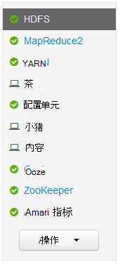
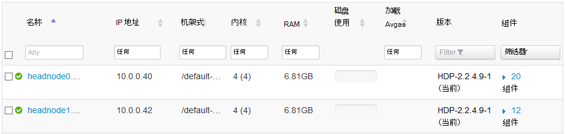
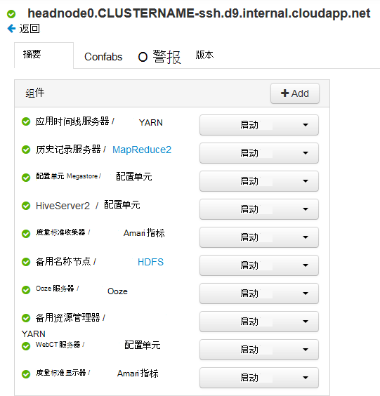
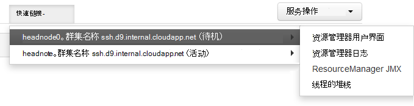
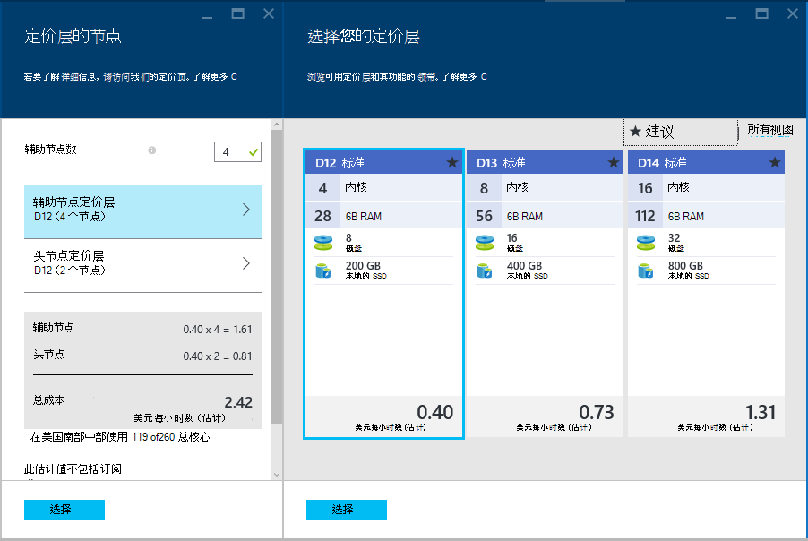

<properties
    pageTitle="高可用性功能的基于 Linux 的 HDInsight (Hadoop) |Microsoft Azure"
    description="了解如何基于 Linux 的 HDInsight 群集使用附加的头节点提高可靠性和可用性。 您将学习如何影响 Hadoop 服务，如 Ambari 和配置单元，以及如何分别连接到每个使用 SSH 的头节点。"
    services="hdinsight"
    editor="cgronlun"
    manager="jhubbard"
    authors="Blackmist"
    documentationCenter=""
    tags="azure-portal"/>

<tags
    ms.service="hdinsight"
    ms.workload="big-data"
    ms.tgt_pltfrm="na"
    ms.devlang="multiple"
    ms.topic="article"
    ms.date="09/13/2016"
    ms.author="larryfr"/>

#在 HDInsight 的 Hadoop 群集的可用性和可靠性

Hadoop 通过在群集中的节点之间分发的服务和数据的冗余拷贝来实现高可用性和可靠性。 但是 Hadoop 的标准分配通常有一个头节点。 单头节点的任何中断都可能导致群集停止工作。

为了解决这种潜在问题，基于 Linux 的 HDInsight 群集在 Azure 上提供两个头节点，以提高可用性和可靠性的 Hadoop 服务和运行的作业。

> [AZURE.NOTE] 使用本文档中的步骤适用于基于 Linux 的 HDInsight 群集。 如果您使用的基于 Windows 群集，信息，请参阅[HDInsight 中的基于 Windows 的 Hadoop 群集的可用性和可靠性](hdinsight-high-availability.md)Windows 特有。

##了解节点

HDInsight 群集中的节点是使用 Azure 虚拟机来实现的。 某个节点发生故障，它处于脱机状态，并创建一个新节点替换出现故障的节点。 节点脱机时，将使用同一类型的另一个节点，直到新节点重新联机。

> [AZURE.NOTE] 如果该节点分析数据，当它失败时，作业进度将会丢失。 故障节点所从事的作业将重新提交到另一个节点。

以下各节讨论了与 HDInsight 一起使用的单独的节点类型。 不是所有的节点类型用于群集类型。 例如，Hadoop 群集类型将没有任何 Nimbus 节点。 使用 HDInsight 群集类型节点的详细信息，请参阅[HDInsight 中的基于创建 Linux 的 Hadoop 群集](hdinsight-hadoop-provision-linux-clusters.md#cluster-types)的群集类型一节。

###头节点

Hadoop 的一些实现具有单个 head 节点承载服务和顺利地管理辅助节点出现故障的组件。 但是，主在头节点上运行的服务的任何中断会导致群集停止工作。

HDInsight 群集提供辅助的头节点，使主服务和组件，以继续在发生故障时在主计算机上的辅助节点运行。

> [AZURE.IMPORTANT] 头的两个节点同时是活动并在群集中运行。 某些服务，如 HDFS 或 YARN，在任何给定时间 （和其它头节点上的备用） 才头的一个节点上的活跃。 在同一时间其他服务，如 HiveServer2 或配置单元 MetaStore 是头的两个节点上的活动。

头节点 （和 HDInsight，其他节点） 有一个数值作为节点的主机名的一部分。 例如，`hn0-CLUSTERNAME`或`hn4-CLUSTERNAME`。 

> [AZURE.IMPORTANT] 不关联的数值与节点是否是主要或次要的;数字值才存在提供一个唯一的名称，每个节点。

###Nimbus 节点

对于风暴群集，Nimbus 节点提供类似的功能，对 Hadoop JobTracker 分配并监视在工作节点的处理。 HDInsight 提供风暴群集类型 2 Nimbus 节点。

###Zookeeper 节点

[ZooKeeper](http://zookeeper.apache.org/ )节点 (ZKs) 用于在头节点上的主服务的领导者选举，以确保服务、 数据 （工作人员） 节点和网关，知道哪头节点主服务处于活动状态。 默认情况下，HDInsight 提供了 3 个 ZooKeeper 节点。

###辅助节点

在作业提交到群集时，辅助节点执行实际的数据分析。 如果辅助节点发生故障，它正在执行的任务将提交给另一个辅助节点。 默认情况下，HDInsight 将创建 4 个工作节点;但是，您可以更改此数量，以满足您的需求，同时在群集创建过程中和之后创建群集。

###边缘节点

边缘节点不会积极参与在群集内的数据分析，但改为使用由开发人员或数据科学家使用 Hadoop 时。 边缘节点作为群集中的其他节点相同的 Azure 虚拟网络中存在，可以直接访问的所有其他节点。 因为不涉及分析数据为群集，可以不必采用资源关键 Hadoop 服务或分析作业的任何考虑使用它。

目前，HDInsight R 服务器是唯一提供边节点的默认的群集类型。 对于 R 服务器在 HDInsight 上，边节点使用前将其提交到分布式处理群集节点上的本地测试 R 代码。

[创建基于 Linux 的 HDInsight 群集与边缘节点上的色调](https://azure.microsoft.com/documentation/templates/hdinsight-linux-with-hue-on-edge-node/)是模板示例，可用于创建具有边节点的 Hadoop 群集类型。

## 访问节点

访问 internet 上的群集提供通过公共网关，并仅限于连接和头节点和 （如果 HDInsight 群集上 R 服务器） 的边缘节点。 在头节点上运行的服务的访问不是受无头的多个节点，如公用网关将请求路由到请求的服务的宿主的头节点。 例如，如果 Ambari 当前承载辅助头节点上，网关将路由传入的请求为 Ambari 到该节点。

在访问群集时使用 SSH，通过端口 22 （SSH，默认值） 连接将连接到主的头节点;通过端口 23 连接将连接到辅助头节点。 例如，`ssh username@mycluster-ssh.azurehdinsight.net`将连接到主名为__mycluster__的群集的头节点。

> [AZURE.NOTE] 这同样适用于基于 SSH，如 SSH 文件传输协议 (SFTP) 的协议。

提供与 R 服务器 HDInsight 群集上的边缘节点也可以直接访问 SSH 通过端口 22。 例如， `ssh username@RServer.mycluster.ssh.azurehdinsight.net` R 上名为__mycluster__的 HDInsight 群集服务器将连接到边缘节点。 

### 内部的完全限定的域名 (FQDN)

HDInsight 群集中的节点具有内部 IP 地址和 FQDN 仅可从群集 （例如头节点或群集上运行的作业的 SSH 会话。）在访问中使用的内部的 FQDN 或 IP 地址的群集服务时，应使用 Ambari 来验证访问该服务时要使用的 ip 地址或 FQDN。

例如，Oozie 服务只能运行在一个头节点，并使用`oozie`的 SSH 会话命令需要该服务的 URL。 这可从 Ambari 通过使用下面的命令︰

    curl -u admin:PASSWORD "https://CLUSTERNAME.azurehdinsight.net/api/v1/clusters/CLUSTERNAME/configurations?type=oozie-site&tag=TOPOLOGY_RESOLVED" | grep oozie.base.url

这将返回类似于以下内容，其中包含要用于该内部 URL 值`oozie`命令︰

    "oozie.base.url": "http://hn0-CLUSTERNAME-randomcharacters.cx.internal.cloudapp.net:11000/oozie"

### 访问其他节点类型

您可以连接到节点不是直接访问 internet 的使用下列方法。

* __SSH__︰ 一旦连接到使用 SSH 头节点，您可以再使用 SSH 从 head 节点连接到群集中其他节点。
* __SSH 隧道__︰ 如果您需要访问驻留在不暴露给 internet 的节点之一的 web 服务，则必须[使用 SSH 隧道](hdinsight-linux-ambari-ssh-tunnel.md)。
* __Azure 虚拟网络__︰ HDInsight 群集是 Azure 虚拟网络的一部分，如果相同的虚拟网络上的任何资源可以直接访问该群集的所有节点。

## 如何查看服务状态

Ambari Web 用户界面或 Ambari REST API，可用于检查在头节点运行的服务的状态。

###Ambari Web 用户界面

Ambari Web 用户界面是可在 https://CLUSTERNAME.azurehdinsight.net 查看。 **群集名称**替换您的群集的名称。 如果出现提示，请输入您的群集 HTTP 用户凭据。 默认 HTTP 用户名是**admin** ，密码是在创建群集时输入的密码。

当您到达 Ambari 页面上时，将在页面的左侧列出已安装的服务。

有一系列用于指示状态的服务旁边可能会出现的图标。 在页的顶部使用**通知**链接，可以查看所有与服务相关的警报。 您可以选择每个服务在其上查看详细信息。

在服务页面上的状态和配置的每个服务提供的信息，它不提供在哪头节点运行服务的信息。 若要查看此信息，请在页的顶部使用**主机**链接。 这将显示包含的头节点的群集中的主机。

选择一个头节点的链接，将显示服务并在该节点上运行的组件。

###Ambari REST API，

Ambari REST API，可通过互联网，并且公用网关处理请求路由到当前驻留 REST API 的头节点。

可以使用下面的命令以检查通过 Ambari REST API 服务的状态︰

    curl -u admin:PASSWORD https://CLUSTERNAME.azurehdinsight.net/api/v1/clusters/CLUSTERNAME/services/SERVICENAME?fields=ServiceInfo/state

* 用 HTTP 用户 （管理员），帐户密码替换**密码**

* **群集名称**替换该群集的名称

* 替换为要检查的状态的服务的名称**服务**

例如，要检查在群集上名为**mycluster**，使用的**密码**，密码**HDFS**服务的状态将使用以下︰

    curl -u admin:password https://mycluster.azurehdinsight.net/api/v1/clusters/mycluster/services/HDFS?fields=ServiceInfo/state

响应将类似如下︰

    {
      "href" : "http://hn0-CLUSTERNAME.randomcharacters.cx.internal.cloudapp.net:8080/api/v1/clusters/mycluster/services/HDFS?fields=ServiceInfo/state",
      "ServiceInfo" : {
        "cluster_name" : "mycluster",
        "service_name" : "HDFS",
        "state" : "STARTED"
      }
    }

该 URL 将告诉我们在名为__hn0 群集名称__的头节点上当前正在运行的服务。

状态告诉我们当前正在运行的服务，或**已启动**。

如果您不知道在群集上安装了哪些服务，您可以使用下列检索列表︰

    curl -u admin:PASSWORD https://CLUSTERNAME.azurehdinsight.net/api/v1/clusters/CLUSTERNAME/services

####服务组件

服务可能会包含您想要逐个检查的状态的组件。 例如，HDFS 包含 NameNode 组件。 若要查看一个组件的信息，该命令将是︰

    curl -u admin:PASSWORD https://CLUSTERNAME.azurehdinsight.net/api/v1/clusters/CLUSTERNAME/services/SERVICE/components/component

如果您不知道哪些组件提供的服务，您可以使用下列检索列表︰

    curl -u admin:PASSWORD https://CLUSTERNAME.azurehdinsight.net/api/v1/clusters/CLUSTERNAME/services/SERVICE/components/component
    
## 如何访问在头节点上的日志文件

###SSH

连接到通过 SSH 头节点时，日志文件可以位于**/var/log**。 例如， **/var/log/hadoop-yarn/yarn**包含日志 YARN。

每头节点可以有唯一的日志条目，因此应该检查在两者上的日志。

###SFTP

您还可以连接到使用 SSH 文件传输协议或安全的文件传输协议 (SFTP)，头节点并直接下载日志文件。

类似于使用 SSH 客户端，当连接到群集必须提供 SSH 用户帐户名称和群集的 SSH 地址。 例如， `sftp username@mycluster-ssh.azurehdinsight.net`。 此外必须提供的密码的帐户出现提示时，或提供一个公共的密钥使用`-i`参数。

建立连接后，将会出现`sftp>`提示。 从命令提示中，您可以更改目录、 上载和下载文件。 例如，以下命令将目录更改到**/var/log/hadoop/hdfs**目录，然后下载该目录中的所有文件。

    cd /var/log/hadoop/hdfs
    get *

有关可用命令的列表，请输入`help`在`sftp>`提示。

> [AZURE.NOTE] 也有图形界面，您可以直观显示文件系统时使用 SFTP 连接。 例如， [MobaXTerm](http://mobaxterm.mobatek.net/)允许您浏览文件系统中使用类似于 Windows 资源管理器接口。

###Ambari

> [AZURE.NOTE] 通过 Ambari 访问日志文件需要 SSH 隧道中，单个服务的网站不公开在 Internet 上。 有关使用 SSH 隧道的信息，请参阅[使用 SSH 隧道 Ambari web 用户界面、 ResourceManager、 JobHistory、 NameNode，Oozie 和其他的 web 用户界面的访问](hdinsight-linux-ambari-ssh-tunnel.md)。

从 Ambari Web 用户界面中，选择您想要查看日志 (例如，YARN) 的服务，然后使用**快速链接**选择要查看的日志的头节点。

## 如何配置节点大小 ##

大小仅在群集创建过程中选择一个节点。 为 HDInsight，包括核心、 内存和本地存储的每个[HDInsight 定价页](https://azure.microsoft.com/pricing/details/hdinsight/)上，可以找到可用的虚拟机大小不同的列表。

在创建新的群集时，可以指定节点的大小。 以下提供的信息有关如何指定使用[Azure 门户]的大小[preview-portal]， [Azure PowerShell][azure-powershell]，和[Azure CLI][azure-cli]:

* **Azure 门户**︰ 在创建新的群集时，系统会提供设置大小的头 （定价层） 的选项工作人员和 （如果使用群集类型） ZooKeeper 节点的群集︰

    

* **Azure CLI**︰ 当使用`azure hdinsight cluster create`命令，您可以通过设置头、 工作人员和 ZooKeeper 节点的大小`--headNodeSize`， `--workerNodeSize`，和`--zookeeperNodeSize`的参数。

* **Azure PowerShell**︰ 当使用`New-AzureRmHDInsightCluster`cmdlet，您可以通过设置头、 工作人员和 ZooKeeper 节点的大小`-HeadNodeVMSize`， `-WorkerNodeSize`，和`-ZookeeperNodeSize`的参数。

##下一步行动

本文档中您已了解如何 Azure HDInsight 的 Hadoop 提供高可用性。 使用以下方法来了解更多有关本文档中提到的事情。

- [Ambari 其他引用](https://github.com/apache/ambari/blob/trunk/ambari-server/docs/api/v1/index.md)

- [安装和配置 Azure CLI](../xplat-cli-install.md)

- [安装和配置 Azure PowerShell](../powershell-install-configure.md)

- [管理使用 Ambari HDInsight](hdinsight-hadoop-manage-ambari.md)

- [提供基于 Linux 的 HDInsight 群集](hdinsight-hadoop-provision-linux-clusters.md)

[preview-portal]: https://portal.azure.com/
[azure-powershell]: ../powershell-install-configure.md
[azure-cli]: ../xplat-cli-install.md
