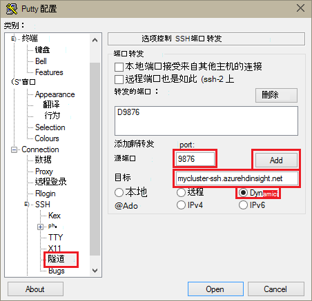

<properties
pageTitle="使用 SSH 隧道访问 Ambari web 用户界面、 ResourceManager、 JobHistory、 NameNode，Oozie 以及其他 web UI 的"
description="了解如何使用 SSH 隧道安全地浏览 web 承载基于 Linux 的 HDInsight 节点上的资源。"
services="hdinsight"
documentationCenter=""
authors="Blackmist"
manager="jhubbard"
editor="cgronlun"/>

<tags
ms.service="hdinsight"
ms.devlang="na"
ms.topic="article"
ms.tgt_pltfrm="na"
ms.workload="big-data"
ms.date="10/17/2016"
ms.author="larryfr"/>

# 使用 SSH 隧道 Ambari web 用户界面、 JobHistory、 NameNode，Oozie 和其他 web 用户界面的访问

基于 Linux 的 HDInsight 群集提供 Ambari web 用户界面访问 internet，但用户界面的某些功能将不可。 例如，通过 Ambari 出现的其它服务 web 用户界面。 Ambari web 用户界面的完整功能，您必须使用群集头到 SSH 隧道。

## 什么需要 SSH 隧道？

几个 Ambari 中的菜单将未完全填充 SSH 隧道，而因为它们依赖于网站和在群集上运行的其他 Hadoop 服务所公开的服务。 通常情况下，这些网站不是安全的因此不直接将其显示在 internet 上的安全。 有时服务如 Zookeeper 节点的另一个群集节点上运行的网站。

以下是 Ambari web 用户界面使用，没有 SSH 隧道将无法访问的服务︰

* JobHistory，
* NameNode，
* 线程的堆栈，
* Oozie web 用户界面
* HBase 主数据和日志的用户界面

如果您使用脚本操作自定义您的群集，任何服务或实用程序安装公开 web 用户界面将需要 SSH 隧道。 例如，如果安装色相使用脚本操作，您必须使用 SSH 隧道访问色相 web 用户界面。

## 什么是 SSH 隧道？

[安全外壳协议 (SSH) 隧道](https://en.wikipedia.org/wiki/Tunneling_protocol#Secure_Shell_tunneling)路由发送到在本地工作站，通过 SSH 连接到您 HDInsight 群集的头节点，其中请求如同它是在头节点上生成然后解析上端口的通信。 然后通过您的工作站向隧道路由响应。

## 系统必备组件

当 web 通信使用 SSH 隧道，您必须具有以下︰

* SSH 客户端。 Linux 和 Unix 分发或 Macintosh OS X`ssh`命令提供与操作系统。 对于 Windows，我们建议[PuTTY](http://www.chiark.greenend.org.uk/~sgtatham/putty/download.html)

    > [AZURE.NOTE] 如果想要而不使用 SSH 客户端`ssh`或 PuTTY，对于如何建立 SSH 隧道客户端，请参阅文档。

* Web 浏览器，可以将配置为使用 SOCKS 代理服务器

## 使用 SSH 命令创建隧道

使用以下命令来创建一个 SSH 隧道使用`ssh`命令。 替换为 HDInsight 群集，SSH 用户的__用户名__，并用 HDInsight 群集的名称替换__群集名称__

    ssh -C2qTnNf -D 9876 USERNAME@CLUSTERNAME-ssh.azurehdinsight.net

这将创建一个通过 SSH 将通信路由到本地端口 9876 到群集的连接。 包含以下选项︰

* **D 9876** -将路由通信通过该隧道的本地端口。

* **C** -压缩所有数据，因为 web 通讯为主要文字。

* **2** -强制 SSH 协议版本 2 只试一次。

* **q** -安静模式。

* **T** -禁用伪 tty 分配，因为我们只转发端口。

* **n** -防止读取标准输入，因为我们只转发端口。

* **N** -不执行远程命令，因为我们只转发端口。

* **f** -在后台运行。

如果您配置了群集，SSH 密钥，您可能需要使用`-i`参数并指定 SSH 密钥的路径。

一旦通过将路由命令完成后，发送到本地计算机上的端口 9876 流量安全套接字层 (SSL) 到群集头节点，看上去是那里。

## 使用 PuTTY 创建隧道

使用以下步骤创建使用 PuTTY SSH 隧道。

1. 打开 PuTTY，并输入连接信息。 如果您还不熟悉 PuTTY，信息，请参阅[使用 SSH 与从 Windows HDInsight 上的基于 Linux 的 Hadoop](hdinsight-hadoop-linux-use-ssh-windows.md)如何使用 HDInsight。

2. 在对话框左侧的**类别**部分中，展开**连接**， **SSH**，展开，然后选择**隧道**。

3. 在**控制 SSH 端口转发选项**窗体中提供以下信息︰

    * **源端口**--您希望转发客户端上的端口。 例如，为**9876**。

    * **目标**-SSH 基于 Linux 的 HDInsight 群集地址。 例如， **mycluster-ssh.azurehdinsight.net**。

    * **动态**-启用动态路由的 SOCKS 代理。

    

4. 单击**添加**以添加设置，然后再单击**打开**来打开 SSH 连接。

5. 如果出现提示，请登录到服务器。 这会建立 SSH 会话并启用隧道。

## 使用您的浏览器从隧道

> [AZURE.NOTE] 本节中的步骤使用 FireFox 浏览器，因为它是免费的 Linux、 Unix、 Macintosh OS X 和 Windows 系统。 其他新式浏览器，也可以使用 SOCKS 代理服务器的支持。

1. 配置浏览器以将**localhost:9876**用作**SOCKS v5**代理。 这里是 Firefox 设置如下所示。 如果您使用不同的端口比 9876，请将端口更改为您使用︰

    

    > [AZURE.NOTE] 选择**远程 DNS**将使用 HDInsight 群集中解决域名系统 (DNS) 的请求。 如果未选中，则将本地解析 DNS。

2. 验证，由 vising [http://www.whatismyip.com/](http://www.whatismyip.com/)等网站启用和禁用在 Firefox 中的代理设置路由通过隧道通信。 设置被启用，IP 地址将在 Microsoft Azure 数据中心机。

##验证与 Ambari web 用户界面

一旦已经建立群集，使用以下步骤验证可以从 Ambari 网站访问服务 web 用户界面︰

1. 在浏览器中，转到 http://headnodehost:8080。 `headnodehost`地址将群集通过隧道发送和解析为在运行 Ambari headnode。 出现提示时，输入管理员用户名 （管理员） 和密码您的群集。 可能会提示您第二次通过 Ambari web 用户界面。 如果是这样，请重新输入信息。
    
    > [AZURE.NOTE] 当使用 http://headnodehost:8080 地址连接到群集，您正在连接的头节点，Ambari 运行使用 HTTP 通信安全使用 SSH 隧道通往隧道的正上方。 通过不使用隧道而 internet 连接时，通信被安全使用 HTTPS。 要通过 internet 使用 HTTPS 连接，使用 https://CLUSTERNAME.azurehdinsight.net，其中__群集名称__是该群集的名称。

2. 从 Ambari Web 用户界面中，从页面左侧列表中选择 HDFS。

    

3. HDFS 服务信息显示，选择__快速链接__。 将群集的头节点的列表。 选择之一的头节点，然后选择__NameNode UI__。

    

    > [AZURE.NOTE] 如果有较慢的 internet 连接，或头节点是非常忙碌，可能会等待指示符，而不是菜单时选择__的快速链接__。 如果是这样，等待一分钟或两个用于数据接收来自该服务器，然后重试该列表。
    >
    > 如果您有较低分辨率的显示器或浏览器窗口未最大化时，__快速链接__菜单中的某些条目可能会被截掉右端的屏幕。 如果是这样，展开菜单使用鼠标，然后使用右箭头键将屏幕滚动到右侧以查看菜单的其余部分。

4. 应出现类似以下的页︰

    

    > [AZURE.NOTE] 请注意 URL 此页;它应该是类似于__http://hn1-CLUSTERNAME.randomcharacters.cx.internal.cloudapp.net:8088/群集__。 这的节点，使用内部完全限定的域名 (FQDN)，而无需使用 SSH 隧道不可访问。

## 下一步行动

现在，您已经学习了如何创建和使用 SSH 隧道，监控和管理您的群集使用 Ambari 查看以下有关信息︰

* [通过使用 Ambari 管理 HDInsight 群集](hdinsight-hadoop-manage-ambari.md)

在 HDInsight 中使用 SSH 的详细信息，请参阅以下资源︰

* [HDInsight 从 Linux、 Unix 或 OS X 上的基于 Linux 的 Hadoop 使用 SSH](hdinsight-hadoop-linux-use-ssh-unix.md)

* [在从 Windows HDInsight 基于 Linux 的 Hadoop 使用 SSH](hdinsight-hadoop-linux-use-ssh-windows.md)
