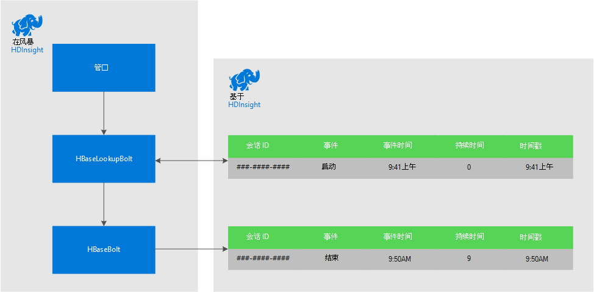
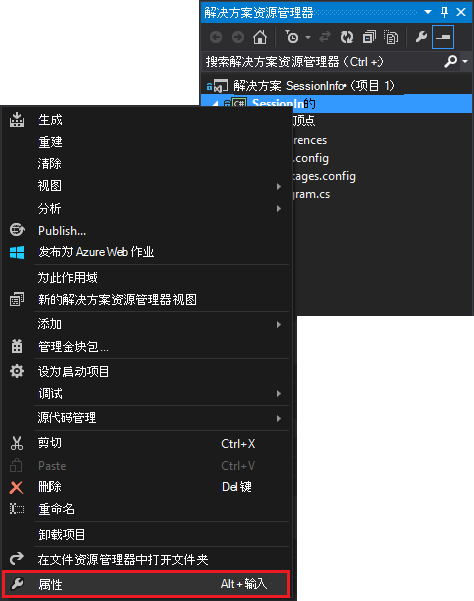
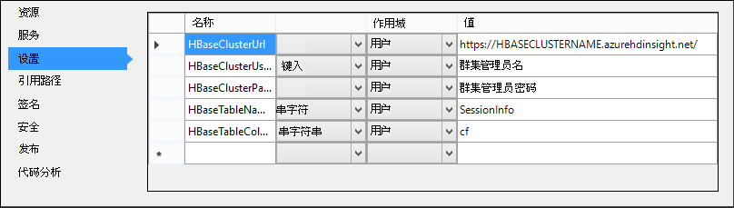

<properties
 pageTitle="随着时间的推移关联的事件，与风暴和 HBase 上 HDInsight"
 description="了解如何将使用 HDInsight 上的暴风雨和 HBase 在不同时间到达的事件相关联。"
 services="hdinsight"
 documentationCenter=""
 authors="Blackmist"
 manager="jhubbard"
 editor="cgronlun"
 tags="azure-portal"/>

<tags
 ms.service="hdinsight"
 ms.devlang="dotnet"
 ms.topic="article"
 ms.tgt_pltfrm="na"
 ms.workload="big-data"
 ms.date="10/27/2016"
 ms.author="larryfr"/>

# 随着时间的推移关联的事件，与风暴和 HBase 上 HDInsight

通过使用 Apache 风暴的永久数据存储区，可以将在不同时间到达的数据条目相关联。 例如，链接用户会话来计算会话持续多长时间登录和注销的事件。

在本文中，您将学习如何创建基本的 C# 风暴拓扑，跟踪登录和注销事件的用户会话，并计算会话的持续时间。 拓扑结构使用 HBase 作为永久数据存储区。 HBase 还允许您执行批处理查询历史数据，以产生更多的见解，如多少用户会话的开始或结束于一个特定的时间段内。

## 系统必备组件

- Visual Studio 和 Visual Studio 的 HDInsight 工具︰ 信息，请参阅[开始使用 Visual Studio 的 HDInsight 工具](../HDInsight/hdinsight-hadoop-visual-studio-tools-get-started.md)安装。

- 在 HDInsight 上的 Apache 风暴群集 （基于 Windows）。 这将运行冲击拓扑，它处理传入的数据并将其存储到 HBase。

    > [AZURE.IMPORTANT] 虽然 SCP.NET 拓扑支持基于 Linux 的风暴 10/28/2016年之后创建的群集，HBase SDK 为.NET 包可用 10/28/2016 年未正常显示 linux。

- 在 HDInsight 群集上的 Apache HBase (Linux 或基于 Windows 的)。 这是此示例的数据存储区。

## 体系结构

关联的事件的事件源需要公共标识符。 例如，用户 ID、 会话 ID 或其他的） 唯一和 b） 发送到风暴的所有数据中包含的数据。 本示例使用 GUID 值表示一个会话 id。

此示例包含两个 HDInsight 群集︰

-   HBase︰ 持久性数据存储历史数据

-   冲击︰ 用来接收传入的数据

数据风暴拓扑中，随机生成，并由以下项目组成︰

-   会话 ID︰ 一个 GUID 唯一地标识每个会话

-   事件︰ 开始或结束的事件。 对于此示例，开始总是发生在结束前

-   时间︰ 事件的时间。

此类数据的处理和存储在 HBase。

### 风暴的拓扑结构

当会话开始时，**开始**事件是接收的拓扑结构和 HBase 中记录。 当收到**结束**事件时，拓扑检索**启动**事件和计算两个事件之间的时间。 此**持续时间**值然后**结束**事件信息一起存储在 HBase。

> [AZURE.IMPORTANT] 虽然此拓扑结构所示的基本模式，需要采取下列方案的设计生产解决方案︰
>
> - 错误的顺序到达的事件
> - 重复事件
> - 删除的事件

示例拓扑结构由以下组件构成︰

-   Session.cs︰ 通过创建一个随机的会话 ID，将持续会话的开始时间，并多长时间来模拟用户会话

-   Spout.cs︰ 创建 100 个会话发出启动事件、 随机超时等待每个会话，然后发出结束事件。 然后回收结束会话以生成新的。

-   HBaseLookupBolt.cs︰ 使用会话 ID 查找 HBase 中的会话信息。 结束事件处理时，它将查找相应的启动事件并计算会话的持续时间。

-   HBaseBolt.cs︰ 存储到 HBase 的信息。

-   TypeHelper.cs︰ 帮助时读取和写入 HBase 的类型转换。

### HBase 架构

在 HBase，数据存储在具有下列架构设置的表︰

-   行键︰ 会话 ID 用作此表中的行的键

-   列族︰ 系列名称是 cf。 此系列中存储的列有︰

    -   事件︰ 开始或结束

    -   时间︰ 毫秒的时间，事件发生的时间

    -   持续时间︰ 开始和结束事件之间的长度

-   版本: cf 系列设置保留的每个行 5 版本

    > [AZURE.NOTE] 版本是以前为特定行键存储的值的记录。 默认情况下，HBase 只返回一行的最新版本的值。 在这种情况下，同一行用于所有事件 （开始，结束。） 的时间戳值标识行的每个版本。 这提供了特定的 id 记录的事件的历史视图

## 下载的项目

可以从[https://github.com/Azure-Samples/hdinsight-storm-dotnet-event-correlation](https://github.com/Azure-Samples/hdinsight-storm-dotnet-event-correlation)下载的样例项目。

该下载内容包含以下 C# 项目︰

-   CorrelationTopology: C# 风暴拓扑随机发出的用户会话的开始和结束事件。 每个会话持续 1 到 5 分钟。

-   SessionInfo: C# 控制台应用程序创建 HBase 表，并提供了示例查询返回有关存储的会话数据的信息。

## 创建表

1. 在 Visual Studio 中打开**SessionInfo**项目。

2. 在**解决方案资源管理器**中，右击**SessionInfo**项目并选择**属性**。

    

3. 选择**设置**，然后设置以下值︰

    -   HBaseClusterURL: HBase 群集到 URL。 例如，https://myhbasecluster.azurehdinsight.net

    -   HBaseClusterUserName︰ 管理/HTTP 用户帐户为您的群集的

    -   HBaseClusterPassword︰ 管理/HTTP 用户帐户的密码

    -   HBaseTableName︰ 此示例中使用的表的名称

    -   HBaseTableColumnFamily︰ 列系列名称

    

5. 运行解决方案。 出现提示时，选择 c 键以在 HBase 群集上创建表。

## 生成和部署风暴拓扑

1.  在 Visual Studio 中打开**CorrelationTopology**解决方案。

2.  在**解决方案资源管理器**中，右击**CorrelationTopology**项目并选择属性。

3.  在属性窗口中，选择**设置**，并提供以下信息。 前 5 应该是**SessionInfo**项目使用相同的值︰

    -   HBaseClusterURL: HBase 群集到 URL。 例如，https://myhbasecluster.azurehdinsight.net

    -   HBaseClusterUserName︰ 管理/HTTP 用户帐户为您的群集的

    -   HBaseClusterPassword︰ 管理/HTTP 用户帐户的密码

    -   HBaseTableName︰ 此示例中使用的表的名称。 此文件应包含与在 SessionInfo 项目中使用相同的表名称

    -   HBaseTableColumnFamily︰ 列系列名称。 此文件应包含为在 SessionInfo 项目中使用相同的列系列名称

    > [AZURE.IMPORTANT] 不会更改 HBaseTableColumnNames，默认值是**SessionInfo**用于检索数据的名称。

4.  保存属性，则生成该项目。

5.  在**解决方案资源管理器**中右击该项目，然后选择**提交到 HDInsight 上的冲击**。 出现提示时，输入的凭据 Azure 订购。

    

6.  在**提交拓扑**对话框中，选择将运行此拓扑的风暴群集。

    > [AZURE.NOTE] 第一次提交一个拓扑结构，可能需要几秒钟才能检索 HDInsight 群集的名称。

7.  已上载并提交给群集拓扑结构，一旦**风暴拓扑视图**将打开，并显示正在运行的拓扑结构。 选择**CorrelationTopology** ，然后使用顶部的刷新按钮右侧的页面刷新的拓扑信息。

    

    当拓扑结构开始生成数据时，则会增加**Emitted**列中的值。

    > [AZURE.NOTE] 如果**风暴拓扑视图**不会自动打开，可以使用以下步骤以将其打开︰
    >
    > 1. 在**解决方案资源管理器**中展开**Azure**，然后再展开**HDInsight**。
    >
    > 2. 右键单击拓扑结构运行的风暴群集，然后选择**视图风暴拓扑**

## 查询的数据

一旦发出的数据，可以使用以下步骤来查询数据。

1. 返回到**SessionInfo**项目。 如果未运行，则启动它的一个新实例。

2. 出现提示时，选择**s**要搜索的启动事件。 您将被提示输入来定义时间范围的开始和结束时间将返回以下两个时间之间的唯一事件。

    输入开始和结束时间时，请使用以下格式︰ hh: mm 和是或 pm。 例如，中午 11:20。

    由于刚刚启动的拓扑结构，使用之前部署它，开始时间和结束时间的现在。 这应抓住大部分在它启动时生成了启动事件。 当运行查询时，您应该看到类似于下面的项的列表︰

        Session e6992b3e-79be-4991-afcf-5cb47dd1c81c started at 6/5/2015 6:10:15 PM. Timestamp = 1433527820737

搜索的结束事件工作启动事件相同。 但是，1 至 5 分钟后开始事件之间随机生成结束事件。 因此可能需要尝试几个时间范围内才能找到结束事件。 结束事件还包含会话的事件开始时间和结束事件时间之间的差异的持续时间。 下面是最终事件数据的一个示例︰

    Session fc9fa8e6-6892-4073-93b3-a587040d892e lasted 2 minutes, and ended at 6/5/2015 6:12:15 PM

> [AZURE.NOTE] 您输入的时间值都是本地时间，而从查询返回的时间将 UTC。

##停止了拓扑

当准备好停止拓扑时，返回到 Visual Studio 中的**CorrelationTopology**项目。 在**风暴的拓扑视图**中，选择拓扑结构，然后在拓扑图视图的顶部，使用**取消**按钮。

##删除群集

[AZURE.INCLUDE [delete-cluster-warning](../../includes/hdinsight-delete-cluster-warning.md)]

##下一步行动

风暴的更多示例，请参阅[在 HDInsight 上的风暴的示例拓扑](hdinsight-storm-example-topology.md)。
 
