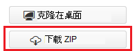
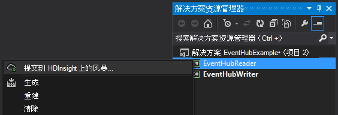
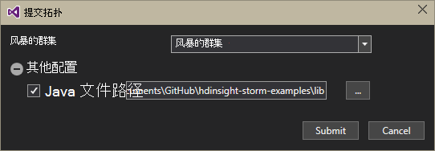

<properties
   pageTitle="处理事件从事件集线器在 HDInsight 上的风暴与 |Microsoft Azure"
   description="了解如何使用 HDInsight 工具使用 Visual Studio 的 Visual Studio 中创建一个 C# 风暴拓扑处理事件集线器数据。"
   services="hdinsight,notification hubs"
   documentationCenter=""
   authors="Blackmist"
   manager="jhubbard"
   editor="cgronlun"/>

<tags
   ms.service="hdinsight"
   ms.devlang="dotnet"
   ms.topic="article"
   ms.tgt_pltfrm="na"
   ms.workload="big-data"
   ms.date="10/27/2016"
   ms.author="larryfr"/>

# HDInsight (C#) 上的风暴与 Azure 事件集线器从流程事件

Azure 事件集线器可以处理大量的数据从网站、 应用程序和设备。 事件集线器管口使其易于使用 Apache 风暴在 HDInsight 分析实时数据。 您还可以编写数据到事件集线器从风暴通过事件集线器螺栓。

在本教程中，您将学习如何使用 HDInsight 工具为 Visual Studio 安装的 Visual Studio 模板用于创建使用 Azure 事件集线器的两种拓扑。

* **EventHubWriter**︰ 随机生成数据，并将其写入事件集线器

* **EventHubReader**︰ 从事件集线器读取数据并将数据记录到风暴日志

> [AZURE.NOTE] 虽然本文档中的步骤依赖于 Windows 使用 Visual Studio 开发环境，已编译的项目可以提交到的 Linux 或基于 Windows HDInsight 群集。 只有基于 Linux 的群集创建后 10/28/2016年支持 SCP.NET 拓扑。
>
> 要基于 Linux 的群集使用 C# 拓扑结构，您必须更新用于您的项目版本 0.10.0.6 或更高版本的 Microsoft.SCP.Net.SDK NuGet 程序包。 软件包的版本还必须匹配的主版本的安装在 HDInsight 上的冲击。 例如，HDInsight 版本 3.3 和 3.4 风暴使用风暴版本 0.10.x，而 HDInsight 3.5 使用风暴 1.0.x 版。
> 
> C# 基于 Linux 的群集拓扑结构必须使用.NET 4.5 中，并使用单声道 HDInsight 群集上运行。 大多数操作起作用，但是您应该检查可能不兼容问题的[单声道兼容性](http://www.mono-project.com/docs/about-mono/compatibility/)文档。
>
> 也适用于基于 Linux 的或基于 Windows 群集，此项目的 Java 版本请参阅[处理事件从 Azure 事件集线器与 HDInsight (Java) 上的冲击](hdinsight-storm-develop-java-event-hub-topology.md)。

## 系统必备组件

* [Apache HDInsight 群集上的风暴](hdinsight-apache-storm-tutorial-get-started.md)

* [Azure 事件中心](../event-hubs/event-hubs-csharp-ephcs-getstarted.md)

* [Azure.NET SDK](http://azure.microsoft.com/downloads/)

* [Visual Studio 的 HDInsight 工具](hdinsight-hadoop-visual-studio-tools-get-started.md)

## 已完成的项目

您可以下载从 GitHub 本教程中创建的项目的完整版本︰ [eventhub-风暴的混合](https://github.com/Azure-Samples/hdinsight-dotnet-java-storm-eventhub)。 但是，您仍需要提供按照本教程中的步骤配置设置。

## 事件集线器管口和螺栓

事件集线器 spout 和螺栓 Java 组件，它们允许您轻松地使用 Apache 风暴从事件集线器。 虽然这些组件用 Java 编写的用于 Visual Studio 的 HDInsight 工具允许您创建混合拓扑混合 C# 和 Java 组件。

管口和螺栓分布为单个 Java 归档文件 (.jar) 文件命名为**eventhubs-storm-spout-#.#-jar-with-dependencies.jar**，其中 #.# 是该文件的版本。

### 下载的.jar 文件

**Lib/eventhubs**文件夹下[HDInsight 风暴示例](https://github.com/hdinsight/hdinsight-storm-examples)项目中包含最新版本的 jar 文件。 要下载该文件，请使用下列方法之一。

> [AZURE.NOTE] 管口和螺栓已经包含在 Apache 风暴项目提交。 有关详细信息，请参阅[风暴 583︰ 签入风暴事件集线器的初始](https://github.com/apache/storm/pull/336/files)在 GitHub 中。

* **下载的 ZIP 文件**︰ 从[HDInsight 风暴示例](https://github.com/hdinsight/hdinsight-storm-examples)网站，**下载 ZIP**右窗格中选择要下载的.zip 文件中包含的项目。

    

    下载文件后，可以解压缩存档文件，并将该文件中的**lib**目录。

* **克隆项目**︰ 如果您有安装[Git](http://git-scm.com/) ，使用下面的命令来克隆存储库中的本地，然后在**lib**目录中查找该文件。

        git clone https://github.com/hdinsight/hdinsight-storm-examples

## 配置事件集线器

事件集线器是此示例的数据源。 在[开始使用事件集线器](../event-hubs/event-hubs-csharp-ephcs-getstarted.md)文档的__创建事件中心__部分使用的信息。

3. 在创建事件中心之后，Azure 门户中查看 EventHub 刀片式服务器并选择__共享访问策略__。 使用__+ 添加__条目添加下列策略︰

  	| 名称 | 权限 |
  	| ----- | ----- |
  	| 编写器 | 发送 |
  	| 读取器 | 侦听 |

    

5. 选择__读取器__和__编写器__的策略。 复制并保存__主关键字__值对于这两种策略，因为这些将在以后使用。

## 配置 EventHubWriter

1. 如果有 HDInsight 工具的最新版本的 Visual Studio 安装，请参阅[开始使用 Visual Studio 的 HDInsight 工具](hdinsight-hadoop-visual-studio-tools-get-started.md)。

2. [Eventhub-风暴-混合](https://github.com/Azure-Samples/hdinsight-dotnet-java-storm-eventhub)从下载的解决方案。 打开的解决方案，花一点时间浏览__EventHubWriter__项目的代码。

4. 在__EventHubWriter__项目中，打开该__App.config__文件。 使用事件中心前面配置的信息并填写以下项的值︰

  	| 密钥 | 值 |
  	| ----- | ----- |
  	| EventHubPolicyName | 编写器 （如果您使用不同的名称具有_发送_权限的策略改为使用。 |
  	| EventHubPolicyKey | 编写策略键 |
  	| EventHubNamespace | 包含事件中心的命名空间 |
  	| EventHubName | 事件中心名称 |
  	| EventHubPartitionCount | 在事件中心的分区数 |

4. 保存并关闭该**App.config**文件。

## 配置 EventHubReader

1. 打开的__EventHubReader__项目，并采取几个 momoents 浏览代码。

2. 打开__App.config__ __EventHubWriter__。 使用事件中心前面配置的信息并填写以下项的值︰

  	| 密钥 | 值 |
  	| ----- | ----- |
  	| EventHubPolicyName | 读取器 （如果您使用不同的名称对_聆听_的权限的策略改为使用。） |
  	| EventHubPolicyKey | 读取器策略键 |
  	| EventHubNamespace | 包含事件中心的命名空间 |
  	| EventHubName | 事件中心名称 |
  	| EventHubPartitionCount | 在事件中心的分区数 |

3. 保存并关闭该**App.config**文件。

## 部署拓扑结构

1. 从**解决方案资源管理器中**，右击**EventHubReader**项目，然后选择**提交到 HDInsight 上的冲击**。

    

2. 在**提交拓扑**屏幕上，选择您的**风暴群集**。 展开**其他配置**、 选择**Java 文件路径**，选择**...** ，选择您之前下载的**eventhubs-storm-spout-0.9-jar-with-dependencies.jar**文件所在的目录。 最后，单击**提交**。

    

3. 当已提交拓扑时，将出现**风暴拓扑查看器**。 在左窗格中，查看统计信息的拓扑选择**EventHubReader**拓扑。 目前，不应发生因为没有事件有尚未写入到事件的集线器。

    

4. 从**解决方案资源管理器中**，右击**EventHubWriter**项目，然后选择**提交到 HDInsight 上的冲击**。

2. 在**提交拓扑**屏幕上，选择您的**风暴群集**。 展开**其他配置**、 选择**Java 文件路径**，选择**...** ，选择您之前下载的**eventhubs-storm-spout-0.9-jar-with-dependencies.jar**文件所在的目录。 最后，单击**提交**。

5. 当已提交拓扑时，刷新**风暴拓扑查看器**来验证在群集上运行这两种拓扑中的拓扑列表。

6. 在**风暴的拓扑查看器**，选择**EventHubReader**拓扑。

4. 在图表视图中，双击__LogBolt__组件。 这将打开__组件摘要__页中的螺栓。

3. 在__执行__部分中，选择一个__端口__列中的链接。 这将显示由该组件记录的信息。 记录的信息内容与以下相似︰

        2016-10-20 13:26:44.186 m.s.s.b.ScpNetBolt [INFO] Processing tuple: source: com.microsoft.eventhubs.spout.EventHubSpout:7, stream: default, id: {5769732396213255808=520853934697489134}, [{"deviceId":3,"deviceValue":1379915540}]
        2016-10-20 13:26:44.234 m.s.s.b.ScpNetBolt [INFO] Processing tuple: source: com.microsoft.eventhubs.spout.EventHubSpout:7, stream: default, id: {7154038361491319965=4543766486572976404}, [{"deviceId":3,"deviceValue":459399321}]
        2016-10-20 13:26:44.335 m.s.s.b.ScpNetBolt [INFO] Processing tuple: source: com.microsoft.eventhubs.spout.EventHubSpout:6, stream: default, id: {513308780877039680=-7571211415704099042}, [{"deviceId":5,"deviceValue":845561159}]
        2016-10-20 13:26:44.445 m.s.s.b.ScpNetBolt [INFO] Processing tuple: source: com.microsoft.eventhubs.spout.EventHubSpout:7, stream: default, id: {-2409895457033895206=5479027861202203517}, [{"deviceId":8,"deviceValue":2105860655}]

## 停止的拓扑

停止拓扑，在**风暴拓扑查看器**中，选择每个拓扑结构，然后单击**终止**。

## 删除群集

[AZURE.INCLUDE [delete-cluster-warning](../../includes/hdinsight-delete-cluster-warning.md)]

## 备注

### 执行检查点操作

EventHubSpout 定期检查其状态到 Zookeeper 节点，从而节省了消息的当前偏移量从队列中读取。 这样的组件以开始接收以下方案中已保存的偏移量处的消息︰

* 组件实例失败，并且将重新启动。

* 扩大或缩小通过添加或移除节点的群集。

* 拓扑被杀死，并且**具有相同的名称**重新启动。

此外可以导出，然后导入 WASB （HDInsight 群集使用 Azure 存储。） 的持久的检查点若要执行此操作的脚本位于 HDInsight 群集，在**c:\apps\dist\storm-0.9.3.2.2.1.0-2340\zkdatatool-1.0\bin**上风暴。

>[AZURE.NOTE] 路径中的版本号可能不同，因为风暴在群集上安装的版本可能会在将来更改。

此目录中的脚本如下︰

* **stormmeta_import.cmd**︰ 从群集默认存储容器的所有风暴元数据导都入到 Zookeeper。

* **stormmeta_export.cmd**︰ 从 Zookeeper 的风暴的所有元数据导出到群集默认存储容器。

* **stormmeta_delete.cmd**︰ 删除 Zookeeper 风暴的所有元数据。

导入允许您时您需要删除该群集，但想要恢复处理从该集线器中的当前偏移量，使新群集返回到联机状态时保持检查点数据的导出。

> [AZURE.NOTE] 由于数据会保存到默认存储容器，新群集**必须**使用相同的存储帐户和容器作为以前的群集。

## 下一步行动

在本文中，您学习了如何使用 Java 事件集线器 Spout 和螺栓从 C# 拓扑结构使用 Azure 事件中心中的数据。 若要了解有关创建 C# 拓扑的详细信息，请参阅以下。

* [在使用 Visual Studio 的 HDInsight 上的 Apache 风暴为开发 C# 拓扑](hdinsight-storm-develop-csharp-visual-studio-topology.md)

* [SCP 编程指南](hdinsight-storm-scp-programming-guide.md)

* [在 HDInsight 上的风暴的示例拓扑](hdinsight-storm-example-topology.md)
 
