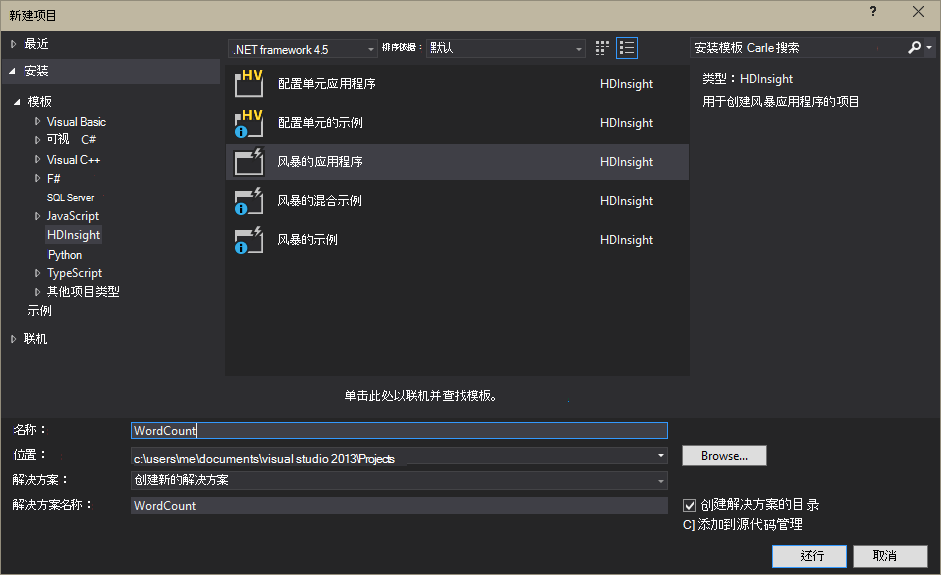
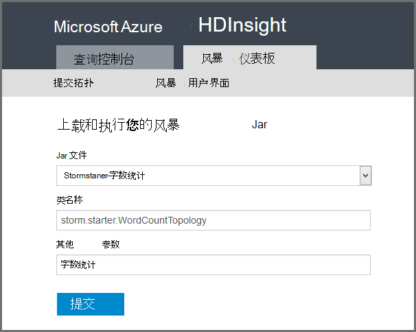

<properties
    pageTitle="介绍在 HDInsight 上的 Apache 风暴 |Microsoft Azure"
    description="Apache 风暴的简介，并了解如何使用风暴在 HDInsight 上建立在云环境中的实时数据分析解决方案。"
    services="hdinsight"
    documentationCenter=""
    authors="Blackmist"
    manager="jhubbard"
    editor="cgronlun"
    tags="azure-portal"/>

<tags
   ms.service="hdinsight"
   ms.devlang="na"
   ms.topic="get-started-article"
   ms.tgt_pltfrm="na"
   ms.workload="big-data"
   ms.date="10/11/2016"
   ms.author="larryfr"/>

#介绍在 HDInsight 上的 Apache 风暴︰ Hadoop 的实时分析

在 HDInsight 上的 Apache 风暴可以使用[Apache Hadoop](http://hadoop.apache.org)在 Azure 的环境中创建分布式、 实时分析解决方案。

##什么是 Apache 风暴？

Apache 风暴是一个分布式、 容错、 开源的计算系统，可用于处理数据实时与 Hadoop。 风暴的解决方案还可以提供有保证的数据，处理重播第一次未成功处理的数据的能力。

##为什么要在 HDInsight 上使用风暴？

在 HDInsight 上的 Apache 风暴是托管的群集集成到 Azure 的环境。 它提供了以下主要优点︰

* 作为托管服务与 99.9%正常运行时间 SLA 执行

* 使用您选择的语言︰ 风暴用**Java**、 **C#**和**Python**编写的组件提供支持

    * 支持多种编程语言︰ 读取数据使用 Java，然后对它使用 C 进行处理#
    
        > [AZURE.NOTE] 在基于 Windows 的 HDInsight 群集仅支持 C# 拓扑。

    * 使用**Trident** Java 接口创建支持"一次"风暴拓扑处理消息、"事务性"数据存储持久性和一组通用流分析操作

* 包括内置的大规模向上和向下伸缩功能︰ 扩展的 HDInsight 群集，不会影响到运行冲击拓扑

* 与其他 Azure 服务，包括事件中心、 Azure 虚拟网络、 SQL 数据库、 Blob 存储和 DocumentDB 集成

    * 使用 Azure 虚拟网络组合的多个 HDInsight 群集功能︰ 创建使用 HDInsight，HBase 或 Hadoop 群集的分析管线

他们实时分析解决方案使用 Apache 冲击的公司的列表，请参见[公司使用 Apache 风暴](https://storm.apache.org/documentation/Powered-By.html)。

若要开始使用风暴，请参阅[开始使用 HDInsight 上的风暴][gettingstarted]。

###方便的资源调配

您可以在几分钟内调配 HDInsight 群集上有新的暴风雨。 指定的群集名称、 大小、 管理员帐户和存储帐户。 Azure 将创建群集，包括样本拓扑结构和 web 管理仪表板。

> [AZURE.NOTE] 您还可以使用[Azure CLI](../xplat-cli-install.md)或[Azure PowerShell](../powershell-install-configure.md)调配风暴簇。

在提交请求的 15 分钟内，将有新风暴群集运行和准备好第一个实时分析管道。

###易用性

您可以连接到群集使用 SSH 和使用__HDInsight 群集上的基于 Linux 的风暴__，`storm`命令来启动和管理拓扑。 此外，可以使用 Ambari 来监视风暴服务和风暴 UI 来监视和管理正在运行的拓扑结构。

使用基于 Linux 的风暴群集的详细信息，请参阅[开始使用基于 Linux 的 HDInsight 上的 Apache 风暴](hdinsight-apache-storm-tutorial-get-started-linux.md)。

__HDInsight 群集上的基于 Windows 的风暴__，Visual Studio 的 HDInsight 工具允许您创建 C# 和混合 C# / Java 的拓扑，然后再提交给您 HDInsight 群集上的冲击。  

Visual Studio 的 HDInsight 工具还提供了一个接口，允许您监视和管理在群集上的风暴拓扑。

使用 HDInsight 工具创建一个风暴的应用程序的示例，请参见[为 Visual Studio 的 HDInsight 工具开发 C# 风暴拓扑](hdinsight-storm-develop-csharp-visual-studio-topology.md)。

对于 Visual Studio HDInsight 工具的详细信息，请参阅[开始使用 Visual Studio 的 HDInsight 工具](../HDInsight/hdinsight-hadoop-visual-studio-tools-get-started.md)。

每个 HDInsight 群集上的风暴还提供了基于 web 的风暴仪表板，您可以提交、 监视和管理在群集上运行的风暴拓扑。

有关使用风暴仪表板的详细信息，请参阅[部署和管理在 HDInsight 上的 Apache 风暴拓扑](hdinsight-storm-deploy-monitor-topology.md)。

在 HDInsight 上的风暴还提供了通过**事件中心 Spout**Azure 事件集线器与轻松集成。 此组件的最新版本的网址[https://github.com/hdinsight/hdinsight-storm-examples/tree/master/lib/eventhubs](https://github.com/hdinsight/hdinsight-storm-examples/tree/master/lib/eventhubs)。 使用此组件的详细信息，请参阅以下文档。

* [开发的 C# 拓扑结构中使用 Azure 事件集线器](hdinsight-storm-develop-csharp-event-hub-topology.md)

* [开发的 Java 拓扑结构中使用 Azure 事件集线器](hdinsight-storm-develop-java-event-hub-topology.md)

###可靠性

Apache 风暴始终保证，每个传入消息将完全处理，即使数据分析扩展到数百个节点。

**Nimbus 节点**到 Hadoop JobTracker 中，提供类似的功能，它将任务分配给通过**Zookeeper**群集中其他节点。 Zookeeper 节点提供群集的协调并促进 Nimbus 辅助节点上的与**主管**进程之间的通信。 如果一个处理节点出现故障，Nimbus 节点将得到通知，并分配到另一个节点的任务和相关联的数据。

Apache 风暴的默认配置是只能有一个 Nimbus 节点。 风暴在 HDInsight 上的运行两个 Nimbus 节点。 如果主节点出现故障，HDInsight 群集将切换到辅助节点，而恢复的主节点。

###小数位数

虽然在创建过程中，您可以指定群集中的节点数，您可以扩大或缩小群集以匹配工作负载。 所有 HDInsight 群集都允许您处理数据时，甚至更改群集中的节点数。

> [AZURE.NOTE] 要利用新节点添加到扩展，您需要重新平衡启动之前群集大小增加的拓扑结构。

###支持

风暴在 HDInsight 上的提供了完整的企业级 24/7 支持。 在 HDInsight 上的风暴也有 99.9%的 SLA。 这意味着我们保证至少 99.9%的时间，群集将具有外部连接。

##实时分析的常见使用情形

以下是一些常见的情况，可以在 HDInsight 使用 Apache 风暴。 现实情况有关的信息，请阅读[公司怎样使用风暴](https://storm.apache.org/documentation/Powered-By.html)。

* (IoT) 物联网
* 欺诈检测
* 社会分析
* 提取、 转换，加载 (ETL)
* 网络监视
* 搜索
* 移动服务

##HDInsight 风暴中的数据是如何处理的？

Apache 风暴运行而不是您可能熟悉在 HDInsight 或 Hadoop 的 MapReduce 作业的**拓扑结构**。 在 HDInsight 群集上的风暴包含两种类型的节点︰ 头运行运行**主管**的**Nimbus**和辅助节点的节点。

* **Nimbus**︰ 类似于在 Hadoop JobTracker，它负责分发整个群集的代码、 将任务分配给虚拟机和监视失败。 HDInsight 提供两个 Nimbus 节点，因此，没有任何单点故障的 HDInsight 上的风暴

* **主管**︰ 为每个工作节点主管负责启动和停止节点上的**辅助进程**。

* **工作进程**︰ 运行一种**拓扑结构**的一个子集。 正在运行拓扑分布整个群集的多个工作进程。

* **拓扑结构**︰ 定义的流程**流**的计算图表。 与 MapReduce 作业不同拓扑运行直到其停止为止。

* **流**︰ 一个未绑定的**元组**集合。 流是通过**spouts**和**螺栓**，和他们所使用的**螺栓**。

* **元组**︰ 命名动态类型化的值的列表。

* **Spout**︰ 使用来自数据源的数据，并发出一个或多个**数据流**。

    > [AZURE.NOTE] 在许多情况下，数据读取队列，如 Kafka、 Azure 服务总线队列或事件集线器。 队列可以确保如果没有中断，保持数据。

* **螺栓**︰ 使用**流**、**元组**，执行处理，并可能发出**流**。 螺栓，还有负责数据写入外部存储，例如队列、 HDInsight、 HBase、 斑点或其他数据存储区。

* **Apache 储蓄**︰ 可扩展的跨语言服务开发的软件框架。 它允许您生成 c + +、 Java、 Python、 PHP、 Ruby、 Erlang、 Perl，Haskell、 C#、 Cocoa、 JavaScript，Node.js，由 Smalltalk 和其他语言之间工作的服务。

    * **Nimbus**是储蓄服务，和一种**拓扑**是储蓄定义，因此可以开发使用多种编程语言的拓扑。

风暴的组件有关的详细信息，请参阅[风暴教程][apachetutorial]在 apache.org。

##可以使用何种编程语言？

在 HDInsight 群集上的风暴提供了 C#、 Java 和 Python 支持。

### C & #35;

Visual Studio HDInsight 工具允许.NET 开发人员设计和在 C# 中实现的拓扑结构。 您还可以创建使用 Java 和 C# 组件的混合拓扑。

有关详细信息，请参见[开发 C# HDInsight 使用 Visual Studio 在 Apache 风暴的拓扑](hdinsight-storm-develop-csharp-visual-studio-topology.md)。

###Java

您会遇到的大多数 Java 示例将纯 Java 或 Trident。 Trident 是便于执行联接、 分组和筛选的聚合的事物的高级抽象。 但是，Trident 作用于成批的元组，而原始的 Java 解决方案一次处理流的一个元组。

关于 Trident 的详细信息，请参阅 apache.org 处的[Trident 教程](https://storm.apache.org/documentation/Trident-tutorial.html)。

Java 和 Trident 拓扑的示例，请参阅 HDInsight 群集上的[列表的示例拓扑，风暴](hdinsight-storm-example-topology.md)初学者示例。

这些风暴初学者示例位于__/usr/hdp/current/storm-client/contrib/storm-starter__目录上基于 Linux 的群集，以及基于 Windows 群集上的**%storm_home%\contrib\storm-starter**目录中。

##什么是一些常见的开发模式？

###有保证的消息处理

风暴可以提供不同级别的有保证的消息处理。 例如，基本的风暴应用程序可以保证在最少的一次处理和 Trident 可以完全保证-一次处理。

详细信息，请参阅 apache.org 在[数据处理上的保证](https://storm.apache.org/about/guarantees-data-processing.html)。

###IBasicBolt

读取输入元组，发出零或多个元组，然后 acking execute 方法末尾输入元组的模式是很常见，并冲击提供自动化此模式的[IBasicBolt](https://storm.apache.org/apidocs/backtype/storm/topology/IBasicBolt.html)接口。

###加入

加入两个数据流之间的应用程序不同而有所不同。 例如，可以为一个新流，加入多个流中的每个元组或可能加入批特定窗口的元组。 无论如何，加入可以通过使用[fieldsGrouping](http://javadox.com/org.apache.storm/storm-core/0.9.1-incubating/backtype/storm/topology/InputDeclarer.html#fieldsGrouping%28java.lang.String,%20backtype.storm.tuple.Fields%29)，它一种定义方式元组被传送到螺栓。

在下面的 Java 示例中，fieldsGrouping 用于传送到**MyJoiner**螺栓是源自"1"、"2"和"3"的组件的元组。

    builder.setBolt("join", new MyJoiner(), parallelism) .fieldsGrouping("1", new Fields("joinfield1", "joinfield2")) .fieldsGrouping("2", new Fields("joinfield1", "joinfield2")) .fieldsGrouping("3", new Fields("joinfield1", "joinfield2"));

###批处理

几种方法可完成批处理。 使用基本的风暴 Java 拓扑，可能之前发出，使用批处理 X 数量的元组的简单计数器也可以使用称为"刻度线元组"每隔 X 秒发出一批内部计时机制。

使用刻度线元组的示例，请参阅[分析与风暴和 HBase HDInsight 上的传感器数据](hdinsight-storm-sensor-data-analysis.md)。

如果您正在使用 Trident，它基于处理批处理的元组。

###缓存

内存中缓存通常使用一种机制，加快处理因为它经常会保留在内存中使用资产。 由于拓扑分布在多个节点，并在每个节点的多个进程，您应该考虑使用[fieldsGrouping](http://javadox.com/org.apache.storm/storm-core/0.9.1-incubating/backtype/storm/topology/InputDeclarer.html#fieldsGrouping%28java.lang.String,%20backtype.storm.tuple.Fields%29)来确保包含用于缓存查找字段的元组始终送交同一进程。 这将避免跨进程的高速缓存项的重复。

###前 N 位流

拓扑取决于计算"前 N"的值，例如上 Twitter，顶部 5 趋势时应计算并行的前 N 值，然后将这些计算的输出合并到一个全局值。 这可以通过使用[fieldsGrouping](http://javadox.com/org.apache.storm/storm-core/0.9.1-incubating/backtype/storm/topology/InputDeclarer.html#fieldsGrouping%28java.lang.String,%20backtype.storm.tuple.Fields%29)字段 （该字段值的分区数据） 的并行螺栓，由工艺路线和然后路由到全局范围内确定的前 N 值一个螺栓。

对于此示例，请参见[RollingTopWords](https://github.com/nathanmarz/storm-starter/blob/master/src/jvm/storm/starter/RollingTopWords.java) 。

##哪种类型的日志记录 does 猛攻使用？

风暴将使用 Apache Log4j 记录的信息。 默认情况下，记录了大量数据，并很难进行排序的信息。 可以控制日志记录行为冲击拓扑结构的一部分包括日志记录配置文件。

有关演示如何配置日志记录，请在 HDInsight 上的风暴，请参阅[基于 Java 的字数统计](hdinsight-storm-develop-java-topology.md)示例的示例拓扑。

##下一步行动

了解更多有关使用 Apache 风暴中 HDInsight 的实时分析解决方案︰

* [入门上 HDInsight 的冲击][gettingstarted]

* [在 HDInsight 上的风暴的示例拓扑](hdinsight-storm-example-topology.md)

[stormtrident]: https://storm.apache.org/documentation/Trident-API-Overview.html
[samoa]: http://yahooeng.tumblr.com/post/65453012905/introducing-samoa-an-open-source-platform-for-mining
[apachetutorial]: https://storm.apache.org/documentation/Tutorial.html
[gettingstarted]: hdinsight-apache-storm-tutorial-get-started-linux.md
