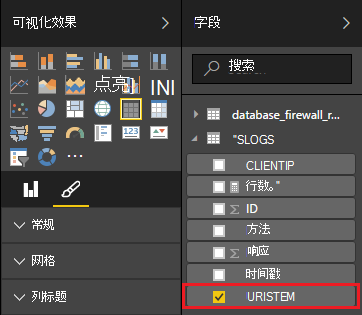

<properties
 pageTitle="使用电源 BI Apache 风暴 |Microsoft Azure"
 description="创建电源 BI 报表使用 HDInsight 在 Apache 风暴群集上运行的 C# 拓扑结构中的数据。"
 services="hdinsight"
 documentationCenter=""
 authors="Blackmist"
 manager="jhubbard"
 editor="cgronlun"
    tags="azure-portal"/>

<tags
 ms.service="hdinsight"
 ms.devlang="dotnet"
 ms.topic="article"
 ms.tgt_pltfrm="na"
 ms.workload="big-data"
 ms.date="10/27/2016"
 ms.author="larryfr"/>

# 使用电源 BI 可视化数据从一个 Apache 风暴的拓扑结构

电源 BI 允许您以可视方式将数据显示为报表。 风暴在 HDInsight 上使用 Visual Studio 模板，可以方便地从到 SQL Azure 上 Apache 风暴 HDInsight 群集上运行的拓扑结构使用存储数据，然后可视化数据使用电源 BI。

在本文中，您将学习如何使用电源 BI 数据通过 Apache 风暴拓扑生成并存储于 SQL Azure 数据库中创建报表。

> [AZURE.NOTE] 虽然本文档中的步骤依赖于 Windows 使用 Visual Studio 开发环境，已编译的项目可以提交到的 Linux 或基于 Windows HDInsight 群集。 只有基于 Linux 的群集创建后 10/28/2016年支持 SCP.NET 拓扑。
>
> 要基于 Linux 的群集使用 C# 拓扑结构，您必须更新用于您的项目版本 0.10.0.6 或更高版本的 Microsoft.SCP.Net.SDK NuGet 程序包。 软件包的版本还必须匹配的主版本的安装在 HDInsight 上的冲击。 例如，HDInsight 版本 3.3 和 3.4 风暴使用风暴版本 0.10.x，而 HDInsight 3.5 使用风暴 1.0.x 版。
> 
> C# 基于 Linux 的群集拓扑结构必须使用.NET 4.5 中，并使用单声道 HDInsight 群集上运行。 大多数操作起作用，但是您应该检查可能不兼容问题的[单声道兼容性](http://www.mono-project.com/docs/about-mono/compatibility/)文档。
>
> 也适用于基于 Linux 的或基于 Windows 群集，此项目的 Java 版本请参阅[处理事件从 Azure 事件集线器与 HDInsight (Java) 上的冲击](hdinsight-storm-develop-java-event-hub-topology.md)。

## 系统必备组件

- Azure 的订阅。 请参阅[获取 Azure 免费试用版](https://azure.microsoft.com/documentation/videos/get-azure-free-trial-for-testing-hadoop-in-hdinsight/)。

* 具有[电源双向](https://powerbi.com)访问的 Azure Active Directory 用户

* Visual Studio （以下版本之一）

    * Visual Studio 2012 与[更新 4](http://www.microsoft.com/download/details.aspx?id=39305)

    * Visual Studio 2013 年[更新 4](http://www.microsoft.com/download/details.aspx?id=44921)或[Visual Studio 2013年社区](http://go.microsoft.com/fwlink/?linkid=517284&clcid=0x409)

    * [Visual Studio 2015 年](https://www.visualstudio.com/downloads/download-visual-studio-vs.aspx)

* Visual Studio HDInsight 工具︰ 信息，请参阅[开始使用 Visual Studio 的 HDInsight 工具](../HDInsight/hdinsight-hadoop-visual-studio-tools-get-started.md)上安装的信息。

## 它的工作原理

该示例包含 Internet Information Services (IIS) 日志数据就会随机生成一个 C# 风暴拓扑结构。 此数据随后会写入 SQL 数据库，并从那里它被用来生成中电源 BI 报告。

下面是实现本示例的主要功能的文件的列表。

* **SqlAzureBolt.cs**︰ 将产生冲击拓扑到 SQL 数据库中的信息。

* **IISLogsTable.sql**︰ 用于生成的数据存储在该数据库的事务处理 SQL 语句。

> [AZURE.WARNING] 在开始 HDInsight 群集拓扑之前，必须在 SQL 数据库中创建表。

## 下载示例

下载[HDInsight 电源 BI C# 风暴的示例](https://github.com/Azure-Samples/hdinsight-dotnet-storm-powerbi)。 若要下载它，分叉/克隆使用[git](http://git-scm.com/)，或者使用的**下载**链接以下载.zip 存档。

## 创建数据库

1. 使用[SQL 数据库指南](../sql-database/sql-database-get-started.md)文档中的步骤来创建新的 SQL 数据库。

2. 连接到的数据库[连接到 SQL 数据库与 Visual Studio](../sql-database/sql-database-connect-query.md)文档中的步骤来连接到数据库。

4. 右键单击在对象资源管理器中的数据库并创建一个__新查询__。 粘贴到查询窗口中，下载项目中包含的__IISLogsTable.sql__文件中的内容，然后使用 Ctrl + Shift + E 执行查询。 您应该收到命令成功完成的消息。

    一旦完成，将数据库中名为__IISLOGS__的新表。

## 配置示例

1. 从[Azure 的门户网站](https://portal.azure.com)，选择 SQL 数据库。 从 SQL 数据库刀片式服务器的__概要__部分中，选中__显示数据库连接字符串__。 从显示的列表中，将复制的__ADO.NET （SQL 身份验证）__的信息。

1. 在 Visual Studio 中打开示例。 从**解决方案资源管理器中**，打开该**App.config**文件，然后找到下面的项︰

        <add key="SqlAzureConnectionString" value="##TOBEFILLED##" />
    
    在上一步中复制的数据库连接字符串替换__# # TOBEFILLED # #__值。 更换__{您\_用户名}__和__{您\_密码}__使用的用户名和密码的数据库。

2. 保存并关闭该文件。

## 部署示例

1. 从**解决方案资源管理器中**，右击**StormToSQL**项目，然后选择**提交到 HDInsight 上的冲击**。 从**风暴群集**下拉列表对话框中选择 HDInsight 群集。

    > [AZURE.NOTE] 它可能需要数秒钟，**风暴群集**下拉列表来填充的服务器名称。
    >
    > 如果出现提示，请输入 Azure 订阅的登录凭据。 如果您有多个订阅，登录到包含您在 HDInsight 群集上的冲击。

2. 已成功提交拓扑结构，应显示为群集风暴的拓扑。 选择从列表以查看有关正在运行的拓扑信息的 SqlAzureWriterTopology 条目。

    

    此视图可用于在拓扑，请参阅信息或双击条目 （如 SqlAzureBolt) 在拓扑中的组件的特定信息，请参阅。

3. 拓扑结构具有后已运行几分钟，返回到 SQL 查询窗口用来创建数据库。 用以下内容替换现有的语句。

        select * from iislogs;
    
    执行查询，并且您使用 Ctrl + Shift + E 应该收到类似如下的结果。
    
        1   2016-05-27 17:57:14.797 255.255.255.255 /bar    GET 200
        2   2016-05-27 17:57:14.843 127.0.0.1   /spam/eggs  POST    500
        3   2016-05-27 17:57:14.850 123.123.123.123 /eggs   DELETE  200
        4   2016-05-27 17:57:14.853 127.0.0.1   /foo    POST    404
        5   2016-05-27 17:57:14.853 10.9.8.7    /bar    GET 200
        6   2016-05-27 17:57:14.857 192.168.1.1 /spam   DELETE  200

    这是从风暴拓扑结构已写入的数据。

## 创建报表

1. 将连接到的[SQL Azure 数据库连接器](https://app.powerbi.com/getdata/bigdata/azure-sql-database-with-live-connect)电源 BI。

2. 在__数据库__中选择__获取__。

3. 选择__SQL Azure 数据库__，然后选择__连接__。

4. 输入要连接到 SQL Azure 数据库的信息。 您可以通过访问[Azure 门户网站](https://portal.azure.com)并选择您的 SQL 数据库发现这。

    > [AZURE.NOTE] 您可以通过使用 [连接] 对话框中__启用高级选项__设置刷新间隔和自定义筛选器。

5. 已连接后，您将看到您连接到的数据库具有相同名称的新数据集。 选择要开始设计报表的数据集。

3. __字段__中，从展开的__IISLOGS__条目。 __URISTEM__选择复选框。 这将创建新的报表，其中列出了 URI 杆 (/ foo，/条形图、 等) 记录到数据库。

    

5. 接下来，将__方法__拖到报表中。 该报告将更新，以列出主干和相应的 HTTP 方法用于 HTTP 请求。

    

4. 从__可视化效果__列中，选择__字段__图标，然后在__值__部分中选择__方法__旁边的向下箭头。 从出现的列表中，选择__计数__。 这会更改该报告列出的特定 URI 已被访问的次数计数。

    

6. 接下来，选择要更改信息的显示方式的__堆积柱形图__。

    

7. 一旦您有了报告需要它，如何使用__保存__项菜单上输入一个名称并保存报告。

## 停止了拓扑

拓扑结构将继续运行，直到您停止它或删除 HDInsight 群集上的风暴。 执行以下步骤以停止拓扑结构。

1. 在 Visual Studio，回到拓扑查看器，然后选择拓扑。

2. 选择**取消**按钮停止拓扑结构。

    

## 删除群集

[AZURE.INCLUDE [delete-cluster-warning](../../includes/hdinsight-delete-cluster-warning.md)]

## 下一步行动

在本文中，您学习了如何将数据从一个风暴拓扑发送到 SQL 数据库，然后使用电源 BI 数据的可视化。 有关如何在 HDInsight 上使用冲击其他 Azure 技术处理的信息，请参阅以下︰

* [在 HDInsight 上的风暴的示例拓扑](hdinsight-storm-example-topology.md)
