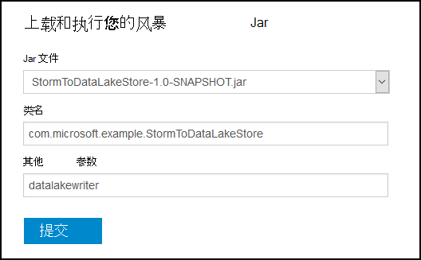
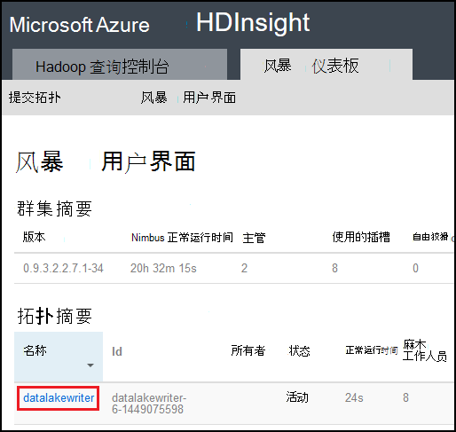

<properties
pageTitle="Apache 在 Azure HDInsight 上的风暴与使用 Azure 数据湖库"
description="了解如何将数据写入到 Azure 数据湖商店从 Apache 风暴拓扑结构在 HDInsight 上。 本文档以及相关联的示例中，演示了如何使用 HdfsBolt 组件写入数据湖存储区。"
services="hdinsight"
documentationCenter="na"
authors="Blackmist"
manager="jhubbard"
editor="cgronlun"/>

<tags
ms.service="hdinsight"
ms.devlang="na"
ms.topic="article"
ms.tgt_pltfrm="na"
ms.workload="big-data"
ms.date="09/06/2016"
ms.author="larryfr"/>

#用 HDInsight 与 Apache 风暴使用 Azure 数据湖库

Azure 数据湖商店是 HDFS 兼容的云存储服务，为您的数据提供高吞吐量、 可用性、 耐用性和可靠性。 在本文中，您将学习如何使用基于 Java 的风暴拓扑结构将数据写入到 Azure 数据湖商店使用[HdfsBolt](http://storm.apache.org/javadoc/apidocs/org/apache/storm/hdfs/bolt/HdfsBolt.html)组件，Apache 风暴的一部分提供。

> [AZURE.IMPORTANT] 本文档中使用的示例拓扑依赖组件的附带 HDInsight 群集上的风暴，可能需要进行修改以使用 Azure 数据湖商店与其他 Apache 风暴群集一起使用时。

##系统必备组件

* [Java JDK 1.7](https://www.oracle.com/technetwork/java/javase/downloads/jdk7-downloads-1880260.html)或更高版本
* [Maven 3.x](https://maven.apache.org/download.cgi)
* Azure 的订阅
* 在 HDInsight 群集版本 3.2 风暴。 以 HDInsight 群集上创建新的风暴，使用[数据湖存储区使用 HDInsight 使用 Azure](../data-lake-store/data-lake-store-hdinsight-hadoop-use-portal.md)文档中的步骤。 此文档中的步骤将引导您完成创建新 HDInsight 群集和 Azure 数据湖存储区。  

    > [AZURE.IMPORTANT] 创建 HDInsight 群集时，必须选择作为群集类型和版本__3.2__ __风暴__。 操作系统可以是 Windows 或 Linux。  

###配置环境变量

在开发工作站上安装 Java 和 JDK 时，可以设置以下环境变量。 但是，您应该检查它们存在，它们包含您系统的正确值。

* __JAVA_HOME__ -应指向 Java 运行时环境 (JRE) 的安装目录。 例如，在 Unix 或 Linux 分发，它应具有值类似于`/usr/lib/jvm/java-7-oracle`。 在 Windows 中，它有值类似于`c:\Program Files (x86)\Java\jre1.7`。

* __路径__-应包含以下路径︰

    * __JAVA\_主页__（或等效的路径）
    
    * __JAVA\_HOME\bin__（或等效的路径）
    
    * Maven 时的安装目录

##拓扑结构实现

本文档中使用该示例编写的 Java，并使用以下组件︰

* __TickSpout__︰ 生成拓扑中的其他组件使用的数据。

* __PartialCount__︰ 计算由 TickSpout 生成的事件。

* __FinalCount__︰ 聚合计算 PartialCount 的数据。

* __ADLStoreBolt__︰ 将数据写入到 Azure 数据湖存储区使用[HdfsBolt](http://storm.apache.org/javadoc/apidocs/org/apache/storm/hdfs/bolt/HdfsBolt.html)组件。

包含此拓扑的项目是可从[https://github.com/Azure-Samples/hdinsight-storm-azure-data-lake-store](https://github.com/Azure-Samples/hdinsight-storm-azure-data-lake-store)下载。

###了解 ADLStoreBolt

ADLStoreBolt 是用于写入 Azure 数据湖的拓扑中的 HdfsBolt 实例的名称。 这不是由 Microsoft; HdfsBolt 的特殊版本但是它依赖核心站点配置值，以及所包含的 Azure HDInsight 通信与数据湖 Hadoop 组件。

特别是，创建一个 HDInsight 的群集时，您可以将其与关联 Azure 数据湖商店。 这将核心站点数据湖存储选择，hadoop 客户端和 hadoop hdfs 等组件用于启用通信与数据湖库条目。

> [AZURE.NOTE] Microsoft 已贡献代码的 Apache Hadoop 和风暴项目使使用 Azure 数据湖商店和 Azure Blob 存储进行通信，但此功能可能不包含默认情况下，在其他 Hadoop 和风暴分发。

在拓扑中的 HdfsBolt 的配置如下所示︰

    // 1. Create sync and rotation policies to control when data is synched
    //    (written) to the file system and when to roll over into a new file.
    SyncPolicy syncPolicy = new CountSyncPolicy(1000);
    FileRotationPolicy rotationPolicy = new FileSizeRotationPolicy(0.5f, Units.KB);
    // 2. Set the format. In this case, comma delimited
    RecordFormat recordFormat = new DelimitedRecordFormat().withFieldDelimiter(",");
    // 3. Set the directory name. In this case, '/stormdata/'
    FileNameFormat fileNameFormat = new DefaultFileNameFormat().withPath("/stormdata/");
    // 4. Create the bolt using the previously created settings,
    //    and also tell it the base URL to your Data Lake Store.
    // NOTE! Replace 'MYDATALAKE' below with the name of your data lake store.
    HdfsBolt adlsBolt = new HdfsBolt()
        .withFsUrl("adl://MYDATALAKE.azuredatalakestore.net/")
        .withRecordFormat(recordFormat)
        .withFileNameFormat(fileNameFormat)
        .withRotationPolicy(rotationPolicy)
        .withSyncPolicy(syncPolicy);
    // 4. Give it a name and wire it up to the bolt it accepts data
    //    from. NOTE: The name used here is also used as part of the
    //    file name for the files written to Data Lake Store.
    builder.setBolt("ADLStoreBolt", adlsBolt, 1)
      .globalGrouping("finalcount");
      
如果您熟悉如何使用 HdfsBolt，您会注意到，这是除 URL 以外的所有非常标准配置。 URL 提供了 Azure 数据湖存储区的根目录的路径。

由于写入数据湖商店使用 HdfsBolt，并且只是 URL 发生更改，您应该能够采取任何现有拓扑中写入 HDFS 或 WASB 使用 HdfsBolt，并轻松地更改它使用 Azure 数据湖存储区。

##构建和打包拓扑

1. 从[https://github.com/Azure-Samples/hdinsight-storm-azure-data-lake-store](https://github.com/Azure-Samples/hdinsight-storm-azure-data-lake-store
)的示例项目下载到您的开发环境。

2. 打开`StormToDataLake\src\main\java\com\microsoft\example\StormToDataLakeStore.java`文件在编辑器中，找到包含的行`.withFsUrl("adl://MYDATALAKE.azuredatalakestore.net/")`。 更改__MYDATALAKE__ Azure 数据湖存储区创建 HDInsight 服务器时所使用的名称。

3. 从命令提示，终端或 shell 会话，将目录更改到根目录下的已下载的项目中，并运行以下命令以生成并打包拓扑结构。

        mvn compile
        mvn package
    
    构建和组装完成后，将有一个名为的新目录`target`，包含名为的文件`StormToDataLakeStore-1.0-SNAPSHOT.jar`。 此属性包含已编译的拓扑结构。

##部署并运行在基于 Linux 的 HDInsight

如果您在 HDInsight 群集上创建基于 Linux 的风暴，使用下面的步骤来部署和运行拓扑结构。

1. 使用下面的命令复制到 HDInsight 群集拓扑结构。 在创建群集时使用 SSH 用户名称替换__用户__。 __群集名称__替换该群集的名称。

        scp target\StormToDataLakeStore-1.0-SNAPSHOT.jar USER@CLUSTERNAME-ssh.azurehdinsight.net:StormToDataLakeStore-1.0-SNAPSHOT.jar
    
    出现提示时，输入在创建 SSH 用户输入群集时使用的密码。 如果您使用公钥而不是密码，您可能需要使用`-i`参数指定的路径匹配的私钥。
    
    > [AZURE.NOTE] 如果您使用 Windows 客户端的开发，您可能不具有`scp`命令。 如果这样，您可以使用`pscp`，这是可从[http://www.chiark.greenend.org.uk/~sgtatham/putty/download.html](http://www.chiark.greenend.org.uk/~sgtatham/putty/download.html)。

2. 上载完成后，使用以下方法来连接到 HDInsight 群集使用 SSH。 在创建群集时使用 SSH 用户名称替换__用户__。 __群集名称__替换该群集的名称。

        ssh USER@CLUSTERNAME-ssh.azurehdinsight.net

    出现提示时，输入在创建 SSH 用户输入群集时使用的密码。 如果您使用公钥而不是密码，您可能需要使用`-i`参数指定的路径匹配的私钥。
    
    > [AZURE.NOTE] 如果使用的 Windows 客户端的开发，并遵照信息[连接到与 Windows 从 SSH 基于 Linux 的 HDInsight](hdinsight-hadoop-linux-use-ssh-windows.md)中的信息使用 PuTTY 客户端连接到该群集。
    
3. 建立连接后，使用以下方法来启动拓扑︰

        storm jar StormToDataLakeStore-1.0-SNAPSHOT.jar com.microsoft.example.StormToDataLakeStore datalakewriter
    
    此操作将启动一个友好的名称与拓扑`datalakewriter`。

##部署并运行在基于 Windows 的 HDInsight

1. 打开 web 浏览器并转到 HTTPS://CLUSTERNAME.azurehdinsight.net，其中__群集名称__是 HDInsight 群集的名称。 出现提示时，提供管理员用户名 (`admin`) 和创建群集时使用此帐户的密码。

2. 从风暴面板中，选择__浏览__从__Jar 文件__下拉列表，然后选择从 StormToDataLakeStore-1.0-SNAPSHOT.jar 文件`target`目录。 为窗体上的其他条目，使用以下值︰

    * 类名称︰ com.microsoft.example.StormToDataLakeStore
    * 附加参数︰ datalakewriter
    
    

3. 选择__提交__按钮上载并启动拓扑结构。 拓扑结构启动后，__提交__按钮下方的结果字段应显示类似于以下的信息︰

        Process exit code: 0
        Currently running topologies:
        Topology_name        Status     Num_tasks  Num_workers  Uptime_secs
        -------------------------------------------------------------------
        datalakewriter       ACTIVE     68         8            10        

##查看输出数据

有多种方法可以查看数据。 在本节中，我们使用 Azure 门户和`hdfs`命令来查看数据。

> [AZURE.NOTE] 应允许运行检查输出数据之前, 的几分钟内，以便数据已被同步到 Azure 数据湖存储区上的几个文件的拓扑。

* __从[Azure 门户](https://portal.azure.com)__︰ 在门户中，选择用 HDInsight Azure 数据湖商店。

    > [AZURE.NOTE] 如果没有未固定到 Azure 门户仪表板湖数据存储区，您可以通过选择左侧，然后为__数据湖商店__，列表底部的__浏览__，最后选择了存储发现。
    
    从数据湖商店顶部的图标，选择__数据资源管理器__。
    
    
    
    接下来，选择__stormdata__文件夹。 应显示的文本的文件的列表。
    
    
    
    选择一个文件以查看其内容。

* __从群集__︰ 如果您已连接到 HDInsight 群集使用 SSH （Linux 群集），或远程桌面 （Windows 群集），您可以使用以下查看的数据。 将__DATALAKE__替换为数据湖存储区的名称

        hdfs dfs -cat adl://DATALAKE.azuredatalakestore.net/stormdata/*.txt

    这将连接存储在目录中，并显示类似于以下的信息的文本文件︰
    
        406000000
        407000000
        408000000
        409000000
        410000000
        411000000
        412000000
        413000000
        414000000
        415000000
        
##停止了拓扑

风暴的拓扑将运行直到停止，或群集已被删除。 若要停止拓扑，请使用下面的信息。

__为基于 Linux 的 HDInsight__:

从群集的 SSH 会话，请使用下面的命令︰

    storm kill datalakewriter

__对于基于 Windows 的 HDInsight__:

1. 从风暴仪表板 (https://CLUSTERNAME.azurehdinsight.net)，选择__风暴 UI__链接在页面的顶部。

2. 一旦风暴 UI 加载时，选择__datalakewriter__链接。

    

3. 在__拓扑操作__部分中，选择__终止__，然后选择在显示的对话框中的确定。

    

## 删除群集

[AZURE.INCLUDE [delete-cluster-warning](../../includes/hdinsight-delete-cluster-warning.md)]

##下一步行动

现在，您已经学习了如何使用风暴要写入到 Azure 数据湖商店，发现其他[HDInsight 的冲击示例](hdinsight-storm-example-topology.md)。
