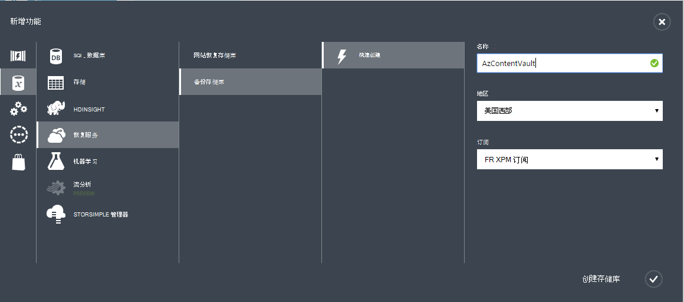

## 创建备份存储库
要备份的文件和数据从 Windows 服务器或 Data Protection Manager (DPM) 到 Azure 或备份到 Azure 的 IaaS Vm 时，必须要用来存储数据的地理区域中创建备份的存储库。

以下步骤将引导您完成创建用于存储备份该存储库。

1. 登录到[管理门户](https://manage.windowsazure.com/)
2. 单击**新建** > **数据服务** > **恢复服务** > **备份存储库**，然后选择**快速创建**。

    

3. **Name**参数，请输入好记的名称来标识备份存储库。 这需要针对每个订阅。

4. 对于**区域**参数，选择备份的存储库的地理区域。 选择将确定您的备份数据发送到的地理区域。 通过选择您所在的位置靠近一个地理区域，您可以备份到 Azure 时减少网络延迟。

5. 单击完成该工作流**创建的电子仓库**。 它可以需要备份的存储库，以创建一段时间。 若要检查状态，您可以监视底部的门户的通知。

    

6. 在创建备份存储库之后，消息将通知您已成功创建存储库。 存储库中还列出了资源恢复服务为**活动状态**。

    

### Azure 备份-存储冗余选项

>[AZURE.IMPORTANT] 确定您的存储冗余选项的最佳时间是存储库创建之后立即和之前任何计算机注册到该存储库。 一旦一项注册到该存储库，存储冗余选项已被锁定，不能修改。

您的业务需求应确定 Azure 备份后端存储的存储冗余。 如果您正在使用 Azure 作为主备份存储终结点 （例如您要备份到 Azure 从 Windows 服务器），则应考虑选择 （默认值） 地理冗余存储选项。 这出现在您的备份存储库的**配置**选项。

#### Geo 冗余存储 (GRS)
GRS 维护数据的六份。 GRS，与您的数据的主区域内复制三次，还可在辅助区域数百英里为主的地区，提供耐用性的最高级别复制三次。 在主要区域中，将数据存储在 GRS，发生故障时 Azure 备份可确保您的数据在两个单独的区域是耐用。

#### 本地冗余存储 (LRS)
本地冗余存储 (LRS) 维护三个副本，您的数据。 LRS 中单个区域中的单个设备复制三次。 LRS 保护您的数据，从正常的硬件故障，但不是能从整个的 Azure 设施故障。

如果使用 Azure 作为第三级的备份存储终结点 (例如使用 SCDPM 来进行本地备份复制内部和为长期保留需要使用 Azure)，则应考虑您的备份存储库的**配置**选项中选择本地冗余存储。 这将同时提供耐用性较低级别的数据，可能是可接受的第三份在 Azure，存储数据的成本。

