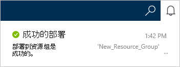

1.  登录到[Azure 的门户](https://portal.azure.com/)。
2.  在 Jumpbar 中，单击**新建**，单击**数据 + 存储**，然后单击**DocumentDB (NoSQL)**。

      

3. 在**新帐户**刀片式服务器，指定所需的配置为 DocumentDB 帐户。

    

    - 在**ID**框中，输入一个名称来标识的 DocumentDB 帐户。  **ID**进行验证后， **ID**框中将显示一个绿色复选标记。 **ID**值将变为 URI 中的主机名称。 **ID**可以包含仅小写字母、 数字和-字符，并必须在 3 到 50 个字符之间。 请注意， *documents.azure.com*被追加到选择，其结果是将成为您的 DocumentDB 帐户终结点的终结点名称。

    - 在**NoSQL API**框中，选择**DocumentDB**。  

    - 对于**订阅**，选择您想要为 DocumentDB 帐户使用 Azure 订阅。 如果只有一个订阅您的帐户，该帐户是默认选中的。

    - 在**资源组**中，选择或创建您的 DocumentDB 帐户的资源组。  默认情况下，创建新的资源组。 有关详细信息，请参阅[使用 Azure 门户管理 Azure 的资源](../articles/azure-portal/resource-group-portal.md)。

    - 使用**位置**指定的地理位置，用来承载您的 DocumentDB 帐户。 

4.  一旦配置了新的 DocumentDB 帐户选项，请单击**创建**。 若要检查部署状态，请检查通知中心。  

      

    

5.  DocumentDB 帐户创建后，就可以使用默认设置。 默认一致性的 DocumentDB 帐户被设置为**会话**。  您可以通过在资源菜单中单击**默认一致性**调整默认一致性。 若要了解有关 DocumentDB 所提供的一致性级别的详细信息，请参阅[DocumentDB 中的一致性级别](../articles/documentdb/documentdb-consistency-levels.md)。

      

      

[How to: Create a DocumentDB account]: #Howto
[Next steps]: #NextSteps
[documentdb-manage]:../articles/documentdb/documentdb-manage.md
