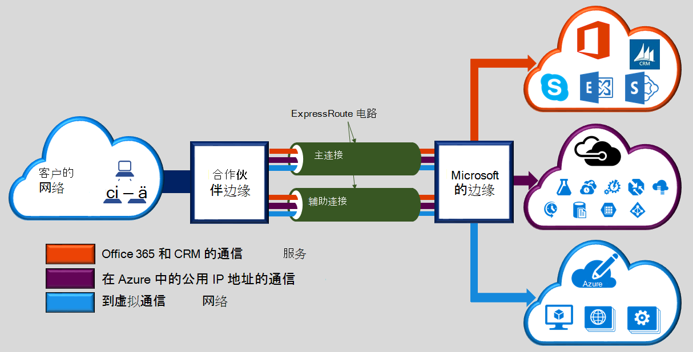

Microsoft Azure ExpressRoute 允许您将内部网络扩展到 Microsoft 云，通过专用的专用连接连接提供便利条件。 使用 ExpressRoute，您可以建立连接到 Microsoft 云服务，例如 Microsoft Azure，Office 365 和 CRM Online。 连接可以从任意到任意的 (IP VPN) 网络、 点对点以太网网络或通过连接提供程序在主机托管设施虚拟交叉连接。 通过公共互联网不会 ExpressRoute 连接。 这使 ExpressRoute 连接在 Internet 上提供更多可靠性、 更快的速度、 更低的延迟时间和更高的安全性，比典型的连接。  

